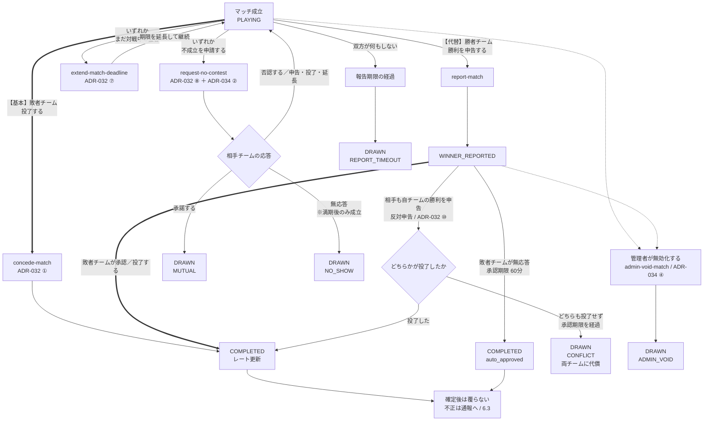
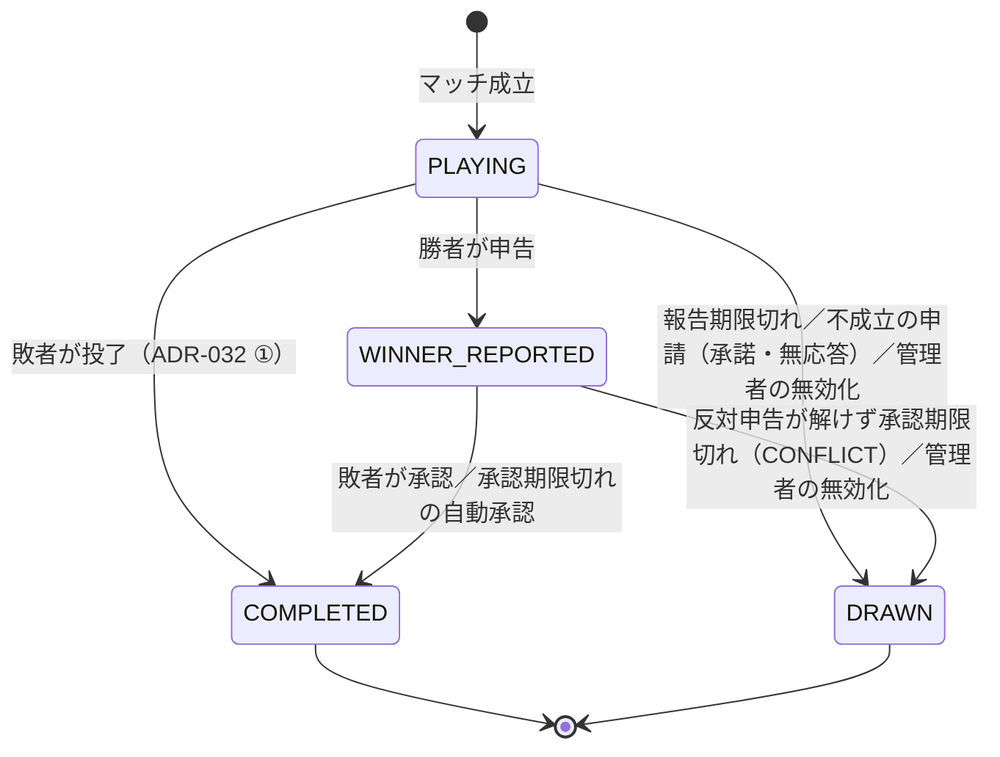
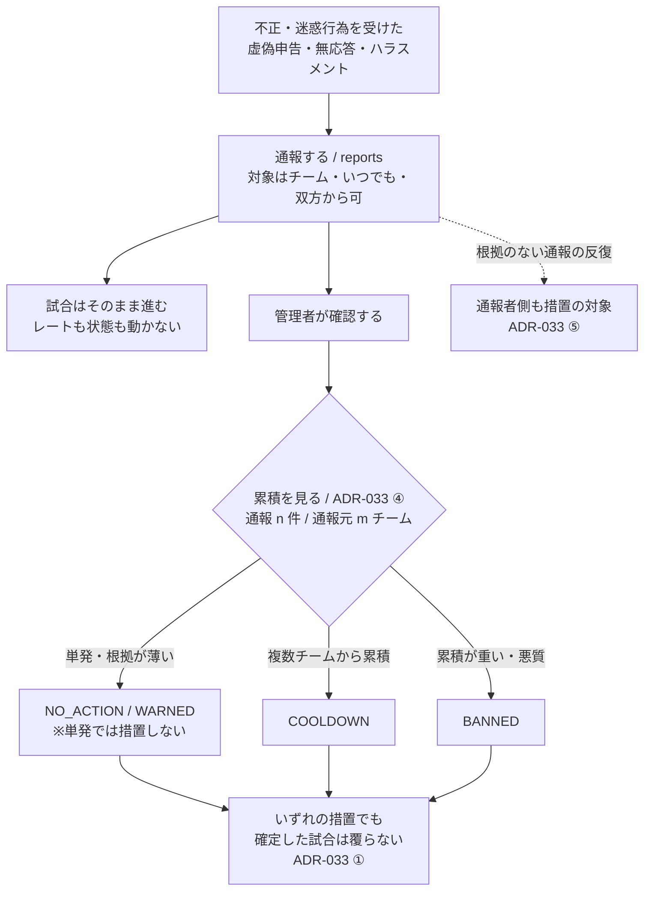
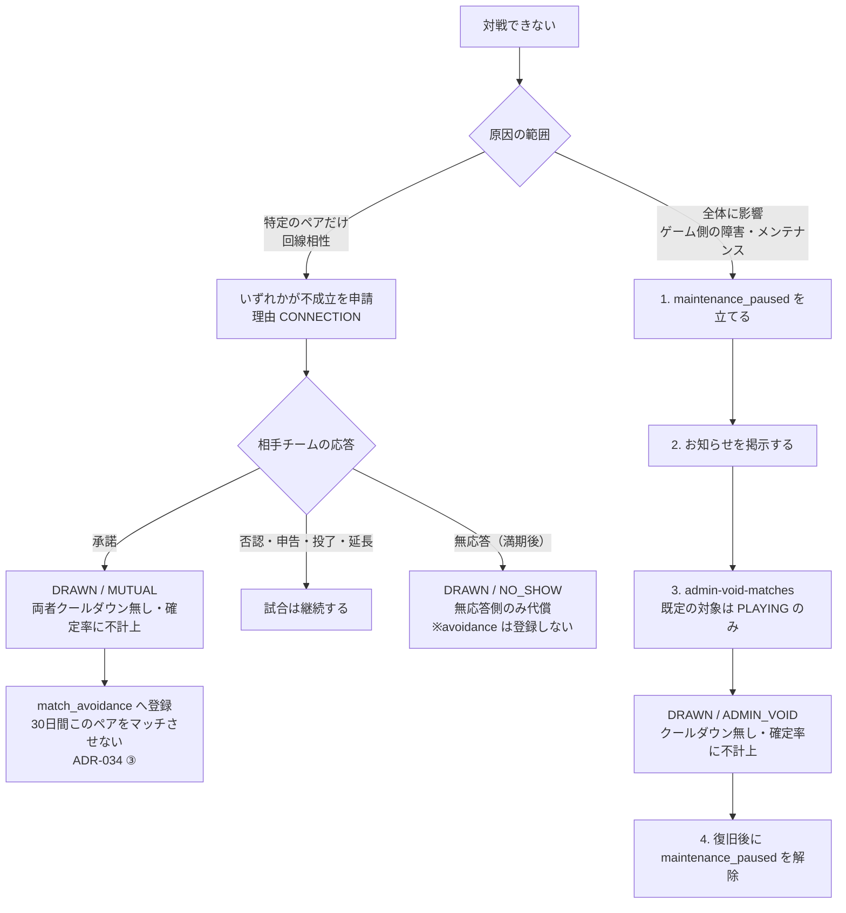

# 15_DecisionLog.md

# Architecture Decision Log (ADR)

---

# 1. 目的

本書は、本システムの設計判断を記録する公式ドキュメントである。

設計変更が発生した場合は、本書を最初に更新し、その後に関連設計書を更新する。

本書を**設計判断**の唯一の正本（Single Source of Truth）とする。

文書間の優先順位は Project Constitution 第9条に定めるものに従う（本書は同条において第2位に位置づけられる）。

ADR-032〜035（勝敗報告の確定方式と同時参加の制約）については、決定を1つの流れとして示す図解を6章に置く。**図解は正本ではない。** 食い違う場合は各ADRの本文を正とする。

---

# 2. 運用ルール

* 新しい設計判断は必ず本書へ追加する。
* 過去の記録は削除しない。
* 設計変更時は新しいADRを追加する。
* 古いADRは履歴として保持する。
* 関連設計書の更新漏れがないことを確認する。

---

# 3. ステータス

| 状態         | 説明             |
| ---------- | -------------- |
| Accepted   | 採用済み           |
| Superseded | 新しいADRに置き換えられた |
| Deprecated | 将来廃止予定         |
| Rejected   | 検討したが採用しなかった   |

---

# 4. ADRテンプレート

| 項目     | 内容                                            |
| ------ | --------------------------------------------- |
| ADR ID | 一意の識別子（例：ADR-001）                             |
| 日付     | 決定日                                           |
| タイトル   | 決定事項の概要                                       |
| ステータス  | Accepted / Superseded / Deprecated / Rejected |
| 理由     | 採用理由・背景                                       |
| 決定内容   | 正式な設計内容                                       |
| 影響文書   | 更新対象の設計書                                      |
| 備考     | 補足事項                                          |

---

# 5. Decision Log

---

## ADR-001

| 項目    | 内容                                                      |
| ----- | ------------------------------------------------------- |
| 日付    | 2026-07-20                                              |
| タイトル  | 対戦チームの保持方法                                              |
| ステータス | Accepted                                                |
| 理由    | 勝敗を明確に管理し、SQLおよびAPI実装を簡潔にするため。                          |
| 決定内容  | `team_a_id` / `team_b_id` を採用する。                        |
| 影響文書  | 03_Database.md、04_BackendInterface.md、07_APISequence.md |
| 備考    | なし                                                      |

---

## ADR-002

| 項目    | 内容                                                         |
| ----- | ---------------------------------------------------------- |
| 日付    | 2026-07-20                                                 |
| タイトル  | 試合完了日時の管理                                                  |
| ステータス | Accepted                                                   |
| 理由    | レート更新済み判定および履歴管理を容易にするため。                                  |
| 決定内容  | `completed_at` を採用する。                                      |
| 影響文書  | 03_Database.md、07_APISequence.md、08_RatingSpecification.md |
| 備考    | `completed_at IS NOT NULL` を試合完了条件とする。                     |

---

## ADR-003

| 項目    | 内容                                                          |
| ----- | ----------------------------------------------------------- |
| 日付    | 2026-07-20                                                  |
| タイトル  | 試合結果確定方式                                                    |
| ステータス | Accepted                                                    |
| 理由    | 誤登録や不正報告を防止するため。                                            |
| 決定内容  | 勝者申告＋敗者承認方式を採用する。                                           |
| 影響文書  | 01_Requirements.md、04_BackendInterface.md、07_APISequence.md |
| 備考    | 敗者承認時にレート更新を実施する。                                           |

---

## ADR-004

| 項目    | 内容                                                       |
| ----- | -------------------------------------------------------- |
| 日付    | 2026-07-20                                               |
| タイトル  | レーティング仕様                                                 |
| ステータス | Accepted                                                 |
| 理由    | シンプルで一般的なEloレーティングを採用するため。                               |
| 決定内容  | 初期レート1500、K値32、引き分けはレート変動なし、許容レート差400を採用する。              |
| 影響文書  | 08_RatingSpecification.md、09_MatchmakingSpecification.md |
| 備考    | レートは小数点第1位で四捨五入する。                                       |

---

## ADR-005

| 項目    | 内容                                               |
| ----- | ------------------------------------------------ |
| 日付    | 2026-07-20                                       |
| タイトル  | APIレスポンス形式                                       |
| ステータス | Accepted                                         |
| 理由    | フロントエンドおよびAIエージェントが統一的に扱えるようにするため。               |
| 決定内容  | すべてのAPIは `result` を返却し、値は `OK`、`NG`、`FATAL` とする。 |
| 影響文書  | 04_BackendInterface.md、06_ErrorCode.md           |
| 備考    | 成功時は `data`、失敗時は `error` を返却する。                  |

---

## ADR-006

| 項目    | 内容                                                                                                    |
| ----- | ----------------------------------------------------------------------------------------------------- |
| 日付    | 2026-07-20                                                                                            |
| タイトル  | フロントエンド技術選定                                                                                           |
| ステータス | Accepted                                                                                              |
| 理由    | AI実装との親和性、保守性、開発効率を重視するため。                                                                            |
| 決定内容  | Bun、React、TypeScript、shadcn/ui、Tailwind CSS、TanStack Router、TanStack Query、React Hook Form、Zod を採用する。 |
| 影響文書  | 05_Frontend.md、12_TechnologyStack.md                                                                  |
| 備考    | フォーマッタは `oxfmt`、リンタは `oxlint` を採用する。                                                                  |

---

## ADR-007

| 項目    | 内容                                                                                                                                                                                                                     |
| ----- | ---------------------------------------------------------------------------------------------------------------------------------------------------------------------------------------------------------------------- |
| 日付    | 2026-08-03                                                                                                                                                                                                             |
| タイトル  | APIレスポンス形式とエラーコード体系の統一                                                                                                                                                                                                 |
| ステータス | Accepted                                                                                                                                                                                                               |
| 理由    | レスポンス形式が2種類、エラーコード命名が4種類併存しており、フロントエンド・テスト・AI実装のいずれもどちらへ従うべきか判断できない状態であったため。                                                                                                                                        |
| 決定内容  | ADR-005を維持し、`result` 形式（`OK` / `NG` / `FATAL`）を唯一の正とする。エラーコードは `06_ErrorCode.md` の `<カテゴリ>-<3桁連番>` 形式（例 `TEAM-004`）を唯一の正本とする。`04_BackendInterface.md` の `success` 形式および `TEAM_NOT_FOUND` 形式のコード一覧は廃止し、06への参照へ置き換える。 |
| 影響文書  | 04_BackendInterface.md、06_ErrorCode.md、02_BasicDesign.md、07_APISequence.md、09_MatchmakingSpecification.md、10_TestSpecification.md（全編）                                                                                   |
| 備考    | 04の各Functionで使用されていたコードのうち06に存在しないものは、06へ追加してから参照する。                                                                                                                                                                   |

---

## ADR-008

| 項目    | 内容                                                                                                                                                                                                                                    |
| ----- | --------------------------------------------------------------------------------------------------------------------------------------------------------------------------------------------------------------------------------------- |
| 日付    | 2026-08-03                                                                                                                                                                                                                            |
| タイトル  | 試合状態モデルの再定義                                                                                                                                                                                                                           |
| ステータス | Accepted                                                                                                                                                                                                                              |
| 理由    | 本システムは対戦管理を行うものであり、選手が実際にゲーム中であるかをシステムは判定できない。そのため `MATCHED` と `PLAYING` を区別する意味がなく、両者を遷移させる手段（試合開始API）も定義されていなかった。                                                                                                                 |
| 決定内容  | `MATCHED` を廃止し、マッチ成立時に `PLAYING` で試合を作成する。あわせて引き分け・時間切れ解散を表す終端状態 `DRAWN` を追加する。状態は `PLAYING` / `WINNER_REPORTED` / `COMPLETED` / `DRAWN` の4種類とし、遷移は `PLAYING → WINNER_REPORTED → COMPLETED`、`PLAYING → DRAWN`、`WINNER_REPORTED → DRAWN` を許可する。 |
| 影響文書  | 01_Requirements.md、02_BasicDesign.md、03_Database.md、04_BackendInterface.md、07_APISequence.md、09_MatchmakingSpecification.md、10_TestSpecification.md、14_Glossary.md                                                                     |
| 備考    | 試合開始API（start-match）は新設しない。Realtimeイベント `MATCH_STARTED` は `MATCH_CREATED` と同時になるため廃止する。`started_at` はマッチ成立時刻を表す。`DRAWN` の詳細はADR-014で定義する。                                                                                          |

---

## ADR-009

| 項目    | 内容                                                                                                              |
| ----- | ----------------------------------------------------------------------------------------------------------------- |
| 日付    | 2026-08-03                                                                                                      |
| タイトル  | 試合結果の報告・承認権限                                                                                                    |
| ステータス | Accepted                                                                                                        |
| 理由    | 「代表者のみ」とするとチーム代表者が不在の間、試合結果を確定できずに滞留するため。運用の簡便さを優先する。                                                            |
| 決定内容  | 勝利申告は勝者チームの**いずれのメンバーでも**実行できる。承認・拒否は敗者チームの**いずれのメンバーでも**実行できる。同一チーム内で複数名が同時に操作した場合は早い者勝ちとし、楽観ロックにより2人目以降は業務エラーとする。 |
| 影響文書  | 01_Requirements.md、02_BasicDesign.md、04_BackendInterface.md、10_TestSpecification.md                              |
| 備考    | ADR-003（勝者申告＋敗者承認方式）の実行主体を明確化するものであり、方式自体は変更しない。                                                                |

---

## ADR-010

| 項目    | 内容                                                                                                                                    |
| ----- | --------------------------------------------------------------------------------------------------------------------------------------- |
| 日付    | 2026-08-03                                                                                                                            |
| タイトル  | チーム代表者の呼称をLeaderに統一                                                                                                                   |
| ステータス | Accepted                                                                                                                              |
| 理由    | 14_Glossaryが `Team Leader` を正式名称・`Owner` を非推奨表現と定めている一方、データベースおよびAPIは `OWNER` を使用しており、さらに「代表者」「リーダー」も混在していたため。用語集の定義に実体を合わせる。         |
| 決定内容  | 正式名称を `Leader` とする。`team_members.role` の値は `'LEADER'` / `'MEMBER'` とし、Edge Function名は `transfer-leader` とする。全設計書から `OWNER`・オーナー・代表者を排除する。 |
| 影響文書  | 全設計書（特に 03_Database.md、04_BackendInterface.md、14_Glossary.md、10_TestSpecification.md）                                                  |
| 備考    | 14_Glossaryの使用例に記載されている `leader_profile_id` は実在しない列であるため、`team_members.role = 'LEADER'` へ修正する。                                        |

---

## ADR-011

| 項目    | 内容                                                                                          |
| ----- | --------------------------------------------------------------------------------------------- |
| 日付    | 2026-08-03                                                                                  |
| タイトル  | クライアント状態管理ライブラリ                                                                             |
| ステータス | Accepted                                                                                    |
| 理由    | ADR-006の採用リストに状態管理ライブラリが含まれておらず、12_TechnologyStackの「React Contextを優先する」という記述と05_Frontendの Zustand 採用が矛盾していたため。 |
| 決定内容  | UI状態の管理には **Zustand** を採用する。サーバー状態は TanStack Query が管理し、Zustandへサーバーデータを保持しない。               |
| 影響文書  | 02_BasicDesign.md、05_Frontend.md、12_TechnologyStack.md                                      |
| 備考    | ADR-006（フロントエンド技術選定）の補足である。12_TechnologyStackの「Redux不採用（React Context優先）」の理由文からContextの記述を削除する。 |

---

## ADR-012

| 項目    | 内容                                                                                                                                                       |
| ----- | ---------------------------------------------------------------------------------------------------------------------------------------------------------- |
| 日付    | 2026-08-03                                                                                                                                               |
| タイトル  | テスト基盤をTypeScriptへ統一                                                                                                                                      |
| ステータス | Accepted                                                                                                                                                 |
| 理由    | 10_TestSpecificationのみがUnit/Integration/Securityテストにpytestを指定しており、他のすべての文書（12_TechnologyStack、05_Frontend、PromptGuide、ImplementationRoadmap）はVitestを前提としていたため。実装言語との一致を優先する。 |
| 決定内容  | テストはすべてTypeScriptで記述する。役割分担は以下とする。 ・Edge Functions：`deno test` ・フロントエンド：Vitest ＋ React Testing Library ・E2E：Playwright ・データベース／RLS：pgTAP テストメソッド名は `describe` / `it` 形式とし、テストIDと組み合わせて記述する。 |
| 影響文書  | 10_TestSpecification.md（全編）、11_Deployment.md、12_TechnologyStack.md、ImplementationRoadmap.md                                                              |
| 備考    | Pythonおよびpytestは採用しない。10_TestSpecificationのテスト環境から Language: Python を削除する。                                                                               |

---

## ADR-013

| 項目    | 内容                                                                                                                        |
| ----- | --------------------------------------------------------------------------------------------------------------------------- |
| 日付    | 2026-08-03                                                                                                                |
| タイトル  | チーム参加を招待制とする                                                                                                              |
| ステータス | Accepted                                                                                                                  |
| 理由    | 03_Databaseに team_invites が「追記（Version 1.1）」としてADR無しで追加され、04_BackendInterfaceも招待制のみを実装する一方、01_Requirementsは「チーム招待」を将来拡張としていたため。実体に合わせて要件を確定する。 |
| 決定内容  | チームへの参加は**招待制のみ**とする。Leaderが発行した招待コードを用いて参加する。招待の有効期限は `system_settings.invite_expiration_hours` で管理し、管理者が変更できる。         |
| 影響文書  | 01_Requirements.md、03_Database.md、04_BackendInterface.md、07_APISequence.md、10_TestSpecification.md、13_FutureFeatures.md    |
| 備考    | 01_Requirementsの将来拡張から「チーム招待」を削除し、MVP機能へ移す。03_Databaseの「追記（Version 1.1）」は本編へ統合する。`join-team` というFunctionは存在しない。          |

---

## ADR-014

| 項目    | 内容                                                                                                                                                                                                                                                                                                                                        |
| ----- | ------------------------------------------------------------------------------------------------------------------------------------------------------------------------------------------------------------------------------------------------------------------------------------------------------------------------------------------- |
| 日付    | 2026-08-03                                                                                                                                                                                                                                                                                                                                |
| タイトル  | 試合の自動解決（報告・承認のタイムアウト）                                                                                                                                                                                                                                                                                                                     |
| ステータス | Accepted                                                                                                                                                                                                                                                                                                                                  |
| 理由    | 敗者が承認しない限り試合が永久に未完了となり、「1チーム同時1試合」の制約と組み合わさると両チームが以後一切マッチングできなくなるため。                                                                                                                                                                                                                                                                        |
| 決定内容  | ①報告期限を過ぎても勝利申告が無い試合は `DRAWN` として解散する。②承認期限を過ぎても承認・拒否が無い試合は自動承認し `COMPLETED` とする（レート更新を実施する）。③承認側は `reject-match` により報告を拒否できる。拒否時は報告内容を破棄して `PLAYING` へ戻し、報告期限を再設定する。拒否回数が上限に達した場合は `DRAWN` として解散する。 期限および上限は `system_settings` で管理する（`report_timeout_minutes`＝初期60、`approve_timeout_minutes`＝初期10、`max_reject_count`＝初期2）。 |
| 影響文書  | 03_Database.md、04_BackendInterface.md、06_ErrorCode.md、07_APISequence.md、08_RatingSpecification.md、10_TestSpecification.md                                                                                                                                                                                                                  |
| 備考    | システムは試合終了を検知できないため（ADR-008）、報告期限の起点はマッチ成立時刻となる。`matches` に `report_deadline_at` / `approve_deadline_at` / `reject_count` / `auto_approved` を追加する。自動承認時は `approved_by_profile_id` をNULLのままとし `auto_approved = true` で表す。`DRAWN` ではレートを更新せず `rating_history` も作成しないため、戦績には計上されない。これにより08_RatingSpecificationの「引き分けはレート変動なし」が正式仕様となる。 |

---

## ADR-015

| 項目    | 内容                                                                                                                                                                     |
| ----- | ------------------------------------------------------------------------------------------------------------------------------------------------------------------------ |
| 日付    | 2026-08-03                                                                                                                                                             |
| タイトル  | 認証プロバイダ非依存のプロフィール設計                                                                                                                                                    |
| ステータス | Accepted                                                                                                                                                               |
| 理由    | Supabase AuthはSteamを標準プロバイダとして提供していない（SteamはOpenID 2.0）。実現可否の検証結果によってはDiscord認証へ切り替える必要があり、`steam_id` を前提としたスキーマでは破壊的変更が発生するため。                                       |
| 決定内容  | `profiles.steam_id` を廃止し、`auth_provider`（`'steam'` / `'discord'`）と `provider_user_id` の組み合わせで利用者を識別する。両者の複合UNIQUEを設定する。認証方式の実現可否はPoCで検証し、Steamが困難な場合はDiscord認証を採用する。 |
| 影響文書  | 01_Requirements.md、03_Database.md、04_BackendInterface.md、11_Deployment.md、12_TechnologyStack.md、14_Glossary.md、10_TestSpecification.md                                 |
| 備考    | PoCの結論を待たずにスキーマを確定することで、後からのマイグレーションを回避する。01_Requirementsの「Steamログイン必須」は「対応する外部OAuthプロバイダによるログイン必須」へ改める。                                                             |

---

## ADR-016

| 項目    | 内容                                                                                                                                                                                                                    |
| ----- | ----------------------------------------------------------------------------------------------------------------------------------------------------------------------------------------------------------------------- |
| 日付    | 2026-08-03                                                                                                                                                                                                            |
| タイトル  | Edge Functionsのトランザクション実装方式                                                                                                                                                                                           |
| ステータス | Accepted                                                                                                                                                                                                              |
| 理由    | 設計書は多数の処理を「単一トランザクションで実行する」と規定しているが、Supabase JavaScript SDK（PostgREST経由）では複数ステートメントにまたがるトランザクションを開始できず、記述どおりに実装できないため。ビジネスロジックの単体テスト容易性も確保する必要がある。                                                                       |
| 決定内容  | Edge Functions（Deno）からPostgreSQLへ直接接続し、TypeScript内で明示的に `BEGIN` / `COMMIT` / `ROLLBACK` を発行する。ビジネスロジック（Eloレート計算等）はTypeScriptの純粋関数として実装し、単体テスト可能とする。PL/pgSQL関数へのロジック集約は採用しない。                                    |
| 影響文書  | 03_Database.md、04_BackendInterface.md、07_APISequence.md、08_RatingSpecification.md、11_Deployment.md                                                                                                                    |
| 備考    | 接続はConnection Pooler経由とし、環境変数 `SUPABASE_DB_URL` を追加する。DB直結はRLSを迂回するため、Edge Function内での認可チェックを必須とする。03_Databaseの `calculate_rating_change()` および `increment_match_version()` は廃止し、レート計算とversion更新はTypeScript側で行う。 **★環境変数名は ADR-028 により `APP_DB_POOL_URL` へ改められた。** `SUPABASE_` は予約接頭辞であり、この名前では Pooler の接続文字列を設定できない。本行は当時の記録として残す。 |

---

## ADR-017

| 項目    | 内容                                                                                                                                                                        |
| ----- | --------------------------------------------------------------------------------------------------------------------------------------------------------------------------- |
| 日付    | 2026-08-03                                                                                                                                                                |
| タイトル  | 監査ログをMVPに含める                                                                                                                                                              |
| ステータス | Accepted                                                                                                                                                                  |
| 理由    | 07_APISequenceの管理機能シーケンスと10_TestSpecificationの計23ケースが監査ログへの記録を前提としている一方、03_Databaseでは `audit_logs` を将来追加予定としており、テストが実行不能な状態であったため。                                     |
| 決定内容  | `audit_logs` テーブルをMVP対象とする。管理者操作・試合結果の確定・認証失敗・権限違反を記録する。本テーブルは追記専用とし、更新・削除を禁止する。参照は管理者のみとする。                                                                           |
| 影響文書  | 02_BasicDesign.md、03_Database.md、04_BackendInterface.md、07_APISequence.md、10_TestSpecification.md                                                                          |
| 備考    | 列構成は `id` / `actor_profile_id`（システム操作時はNULL）/ `action` / `target_type` / `target_id` / `payload` / `created_at` とする。レートリセットの記録も本テーブルで扱い、`rating_history` へは登録しない。          |

---

## ADR-018

| 項目    | 内容                                                                                                          |
| ----- | ------------------------------------------------------------------------------------------------------------- |
| 日付    | 2026-08-03                                                                                                  |
| タイトル  | ランキングの未認証公開                                                                                                 |
| ステータス | Accepted                                                                                                    |
| 理由    | 03_Databaseは `teams` のSELECTを「全員」とする一方、04_BackendInterfaceと10_TestSpecificationは認証必須としており、公開範囲が確定していなかったため。 |
| 決定内容  | ランキングおよびチームの公開情報は**未認証でも閲覧できる**。プロフィール情報（表示名・プロバイダID等）は認証を必須とし、ランキングには含めない。                                |
| 影響文書  | 03_Database.md、04_BackendInterface.md、05_Frontend.md、10_TestSpecification.md                                 |
| 備考    | ランキング画面を未認証で表示するため、05_FrontendのRoute構成でRankingをPublicLayout配下へ移す。                                           |

---

## ADR-019

| 項目    | 内容                                                                                                                                     |
| ----- | ---------------------------------------------------------------------------------------------------------------------------------------- |
| 日付    | 2026-08-03                                                                                                                             |
| タイトル  | ディレクトリ構成の統一                                                                                                                            |
| ステータス | Accepted                                                                                                                               |
| 理由    | 00_DirectoryStructure、05_Frontend、12_TechnologyStackが互いに異なる `src/` 構成を定義しており、さらに Edge Functions とMigrationの配置先を定義した文書が12のみであったため。      |
| 決定内容  | 12_TechnologyStackの構成を基準とし、`supabase/{functions,migrations,seed}` を正式なバックエンド資産の配置先とする。フロントエンドは Feature First を維持し、TanStack Router採用に伴い `src/routes/` を設ける。 |
| 影響文書  | 00_DirectoryStructure.md、05_Frontend.md、12_TechnologyStack.md、AIContext.md                                                             |
| 備考    | AIContext.mdの記入例にある `src/functions/team/*` は誤りであるため `supabase/functions/*` へ修正する。                                                       |

---

## ADR-020

| 項目    | 内容                                                                                                                                                                                                                                                                                                                                            |
| ----- | ----------------------------------------------------------------------------------------------------------------------------------------------------------------------------------------------------------------------------------------------------------------------------------------------------------------------------------------------- |
| 日付    | 2026-08-03                                                                                                                                                                                                                                                                                                                                    |
| タイトル  | 管理者の識別方式                                                                                                                                                                                                                                                                                                                                      |
| ステータス | Accepted                                                                                                                                                                                                                                                                                                                                      |
| 理由    | 設計書は多数の箇所で「管理者」による認可を規定していたが、**誰が管理者であるかを判定する手段が定義されていなかった**。当初 `profiles.is_admin` 列で解決したが、原本の「認可は Supabase JWT と管理者ロールで制御する」という記述はJWTに埋め込まれたロールを想定しており、アプリケーション側テーブルの列は設計意図から乖離していた。管理者はSupabaseプロジェクトの運用者であり、アプリケーション内に管理者を登録する機能は不要である。                                                                                                                       |
| 決定内容  | 管理者は **Supabase Auth の `app_metadata`** で表す（`{"role": "admin"}`）。付与はSupabaseダッシュボード・Admin API（service_role）・SQLのいずれかで行い、アプリケーションからは付与できない。判定は以下による。 ・RLS：`(auth.jwt() -> 'app_metadata' ->> 'role') = 'admin'` ・Edge Function：検証済みJWTの `app_metadata.role` を参照（DBアクセス不要） ・フロントエンド：セッションJWTの `app_metadata.role` `profiles.is_admin` 列および `auth_is_admin()` 関数は採用しない。 |
| 影響文書  | 01_Requirements.md、02_BasicDesign.md、03_Database.md、04_BackendInterface.md、05_Frontend.md、07_APISequence.md、11_Deployment.md、14_Glossary.md、10_TestSpecification（Part7・Part8）                                                                                                                                                                  |
| 備考    | `app_metadata` は `user_metadata` と異なり service_role でのみ更新可能であるため、利用者による自己昇格が構造的に不可能となる。RLSポリシーで防ぐ必要がなくなり、`auth_is_admin()`（SECURITY DEFINER関数）も不要になる。これにより 03_Database.md 2.6「DBにビジネスロジック関数を定義してはならない」の例外が解消する。 トレードオフとして、付与は対象利用者のJWTが更新される（再ログインまたはトークンリフレッシュ）まで反映されない。 管理操作を行う管理画面および `admin-*` Edge Function は従来どおり維持する。管理者の**識別方式**のみを変更するものである。 |

---

## ADR-021

| 項目    | 内容                                                                                                                                                                                                                                                                                                                                            |
| ----- | ----------------------------------------------------------------------------------------------------------------------------------------------------------------------------------------------------------------------------------------------------------------------------------------------------------------------------------------------- |
| 日付    | 2026-08-03                                                                                                                                                                                                                                                                                                                                    |
| タイトル  | Edge Functions の共通処理の配置                                                                                                                                                                                                                                                                                                                       |
| ステータス | Accepted                                                                                                                                                                                                                                                                                                                                      |
| 理由    | `ImplementationRoadmap.md` 5章は実装順序の2番目に「トランザクション基盤（DB直結・共通処理）」を置き、「すべての更新系Functionがこれを前提とする」と規定している。しかし **共通処理の配置場所が 00_DirectoryStructure.md に定義されていなかった**。このまま19本のEdge Functionを実装すると、JWT検証・共通レスポンス生成・トランザクション制御・DB接続が各Functionに複製される。共通レスポンス形式（04_BackendInterface 5章）を1箇所変更するために19ファイルの修正が必要になり、`06_ErrorCode.md` との整合を保つ保証も失われる。 |
| 決定内容  | Edge Functions の共通処理を **`supabase/functions/_shared/`** に配置する。アンダースコア始まりのディレクトリはSupabase CLIがFunctionとしてデプロイしないため、共有モジュールの標準的な置き場所である。各Edge Functionは相対パス（`../_shared/*.ts`）でこれをimportする。 `_shared/` が担う責務は以下に限定する。 ・共通レスポンスの生成（04_BackendInterface 5章の成功・業務エラー・システムエラー形式） ・JWTの検証とクレーム取り出し（同 4.3） ・DB接続プールの取得とトランザクション制御（同 2.1 / ADR-016） 業務ロジックは `_shared/` に置かない。 |
| 影響文書  | 00_DirectoryStructure.md、04_BackendInterface.md、ImplementationRoadmap.md                                                                                                                                                                                                                                                                      |
| 備考    | 本決定は配置場所の明文化であり、`ImplementationRoadmap.md` 5章が既に定めた実装順序（共通処理を各Functionより先に実装する）を変更するものではない。 テスト用の依存差し替え口（DBプール・JWT検証）も `_shared/` に集約されるため、各Functionが個別に注入口を実装する必要がなくなる。                                                                                                                                                                     |

---

## ADR-022

| 項目    | 内容                                                                                                                                                                                                                                                                                                                                                                                                                                                                             |
| ----- | -------------------------------------------------------------------------------------------------------------------------------------------------------------------------------------------------------------------------------------------------------------------------------------------------------------------------------------------------------------------------------------------------------------------------------------------------------------------------------- |
| 日付    | 2026-08-04                                                                                                                                                                                                                                                                                                                                                                                                                                                                     |
| タイトル  | 認証プロバイダを Discord に確定する                                                                                                                                                                                                                                                                                                                                                                                                                                                        |
| ステータス | Accepted                                                                                                                                                                                                                                                                                                                                                                                                                                                                       |
| 理由    | ADR-015 は「PoCで検証し、Steamが困難な場合はDiscord認証を採用する」としたが、この未決状態が R-001（Critical / High）として実装全体を止めていた。Steam は OpenID 2.0 であり Supabase Auth の標準プロバイダに存在しない。採用するには OpenID 2.0 の検証と Supabase セッションへの橋渡しを自前の Edge Function で実装する必要があり、MVPの到達時期を大きく後退させる。Discord は Supabase Auth の標準プロバイダであり、追加実装なしで成立する。                                                                                                                                                                                                    |
| 決定内容  | MVPの認証プロバイダを **Discord** に確定する。PoC（ADR-015・Roadmap Phase 3 冒頭）は実施せず、通常実装として扱う。 `profiles.auth_provider` は ADR-015 のとおりプロバイダ非依存のまま維持し、`CHECK (auth_provider IN ('steam','discord'))` も変更しない。Steam は将来機能（`13_FutureFeatures.md`）として追加可能な状態を保つ。 環境変数名 `AUTH_PROVIDER_CLIENT_ID` / `AUTH_PROVIDER_SECRET` はプロバイダ非依存の名称のまま変更しない（ADR-015）。                                                                                                                                             |
| 影響文書  | 01_Requirements.md、05_Frontend.md、12_TechnologyStack.md、13_FutureFeatures.md、ImplementationRoadmap.md、Milestones.md、RiskManagement.md、ProjectStatus.md                                                                                                                                                                                                                                                                                                                        |
| 備考    | 本ADRにより R-001 を Closed とする。スキーマ変更は発生しない（ADR-015 が既にプロバイダ非依存としているため）。 `ensure-profile` は `provider_user_id` を JWT の `user_metadata.provider_id` から取得する。`auth_provider` の既定値を `'steam'` としてはならない。                                                                                                                                                                                                                                                                          |

---

## ADR-023

| 項目    | 内容                                                                                                                                                                                                                                                                                                                                                                                                                                                                                                                                                       |
| ----- | --------------------------------------------------------------------------------------------------------------------------------------------------------------------------------------------------------------------------------------------------------------------------------------------------------------------------------------------------------------------------------------------------------------------------------------------------------------------------------------------------------------------------------------------------------- |
| 日付    | 2026-08-04                                                                                                                                                                                                                                                                                                                                                                                                                                                                                                                                               |
| タイトル  | MVPの実装進行を縦切りスライス方式へ変更する                                                                                                                                                                                                                                                                                                                                                                                                                                                                                                                                |
| ステータス | Accepted                                                                                                                                                                                                                                                                                                                                                                                                                                                                                                                                                 |
| 理由    | `ImplementationRoadmap.md` の Phase 構成（Database → Backend API 全20本 → Frontend）は層ごとの横切りであり、フロントエンドが動作するのは Phase 5 以降である。しかし現時点で Migration は `supabase db push` が完走せず、共通JWT検証は全リクエストを 401 にし、実装済み2本のEdge Functionもテーブル定義と不整合である。これらの基盤欠陥は**層を貫通させて初めて表面化する**種類のものであり、Edge Function を20本積み上げてから発見した場合の手戻りが大きい。                                                                                                                                                                                                                                                |
| 決定内容  | MVPの実装を、機能を層で切らず**縦に貫通する薄いスライス**の連続として進める。最初のスライスは「Discordログイン → プロフィール生成 → チーム作成 → ランキング表示」とし、DB・Edge Function・フロントエンドを同時に通す。 また、クラウドのSupabaseプロジェクトへ push する前に、**Supabase Local（Docker）で `supabase db reset` を完走させる**ことを必須の前提条件とする。 `ImplementationRoadmap.md` の Phase 1〜7 はスライス S0〜S6 へ置き換える。ただし同5章の実装順序原則（トランザクション基盤を先に、RatingをMatchより先に）は変更しない。                                                                                                                                                                                                                     |
| 影響文書  | ImplementationRoadmap.md、Milestones.md、ProjectStatus.md、Backlog.md                                                                                                                                                                                                                                                                                                                                                                                                                                                                                       |
| 備考    | 本決定は実装の**進行順序**に関するものであり、設計内容・アーキテクチャ・技術選定を変更しない。各スライスの完了条件は Project Constitution 第18条の品質ゲートを緩和しない。 スライス方式においても、未着手スライスの実装を先行してはならない（Roadmap 10章）。                                                                                                                                                                                                                                                                                                                                                                                             |

---

## ADR-024

| 項目    | 内容                                                                                                                                                                                                                                                                                                                                                                                                                                                                              |
| ----- | --------------------------------------------------------------------------------------------------------------------------------------------------------------------------------------------------------------------------------------------------------------------------------------------------------------------------------------------------------------------------------------------------------------------------------------------------------------------------------- |
| 日付    | 2026-08-04                                                                                                                                                                                                                                                                                                                                                                                                                                                                      |
| タイトル  | 未適用Migrationに限り直接修正を許可する                                                                                                                                                                                                                                                                                                                                                                                                                                                      |
| ステータス | Accepted                                                                                                                                                                                                                                                                                                                                                                                                                                                                        |
| 理由    | `11_Deployment.md` 10.1 は「適用済みの Migration を編集しない（追加方式）」と定めている。しかし `0001`〜`0014` は**いかなる環境にも一度も適用されていない**。うち3件は構文・定義の誤りにより `supabase db push` 自体を停止させるため、追加方式に従うと「壊れた初版とその打ち消し」を恒久的にリポジトリへ残すことになる。これは新規参画者およびAIの誤読を招き、`03_Database.md` との対応も追えなくなる。                                                                                                                                                                                                                                              |
| 決定内容  | **どの環境にも未適用の Migration に限り**、既存ファイルの直接修正を許可する。適用済みとなった時点で以後は 11_Deployment 10.1 の追加方式へ戻り、直接修正を禁止する。 「適用済み」の判定は、Supabase Local を含むいずれかの環境で当該 Migration が適用された時点とする。最初のクラウド `supabase db push` の完了をもって `0001`〜`0014` は確定し、以後の変更はすべて新規 Migration の追加で行う。                                                                                                                                                                                                                                    |
| 影響文書  | 11_Deployment.md、ImplementationRoadmap.md、Backlog.md                                                                                                                                                                                                                                                                                                                                                                                                                            |
| 備考    | 本例外は初版確定までの一度限りである。down migration を作成しない方針（11_Deployment 10.2）は変更しない。                                                                                                                                                                                                                                                                                                                                                                                                     |

---

## ADR-025

| 項目    | 内容 |
| ----- | -- |
| 日付    | 2026-08-07 |
| タイトル  | パッケージ管理を Bun へ一本化する |
| ステータス | Accepted |
| 理由    | `12_TechnologyStack.md` 3章は Bun を正本としているが、S0.5 の時点では Bun が未導入であったため npm ＋ `package-lock.json` で暫定運用していた。B-011 で Bun を導入するにあたり、両者を併存させるとロックファイルが2つになり、CI とローカルで解決される依存が一致しなくなる。 |
| 決定内容  | パッケージ管理を **Bun** に一本化する。`bun.lock` を正本とし、`package-lock.json` は削除する。CI も `bun install --frozen-lockfile` を使う。 ランタイムは用途で3つに分かれる。**Bun**（フロントエンド・Unit / Frontend Test）、**Deno**（Edge Functions・Integration Test）、**pgTAP**（Database Test）。Edge Functions が Deno 上で動作する以上この分割は避けられないため、パッケージ管理の一本化は Node 側に限る。 Edge Functions の依存は `https:` のフルURLで固定し、`jsr:` 版は採用しない。`jsr:` はnpm依存の解決にルートの `node_modules` を要求し、Bun 側のツールチェインと衝突するためである。 |
| 影響文書  | 11_Deployment.md（11.3.1）、12_TechnologyStack.md（5.1・5.2）、Backlog.md（B-011） |
| 備考    | `bun.lock` はコミットする。Deno 側の `deno.lock` は引き続き併存し、役割が重複しない。 |

---

## ADR-026

| 項目    | 内容 |
| ----- | -- |
| 日付    | 2026-08-07 |
| タイトル  | TanStack Router をファイルベースルーティングで使う |
| ステータス | Accepted |
| 理由    | ADR-006 はルーターとして TanStack Router を採用することのみを定め、ルーティングの記述方式（コードベース / ファイルベース）を定めていなかった。`05_Frontend.md` 5章は Layout の入れ子を含む20画面規模のルート木を定義しており、方式を決めずに実装を進めると後から一括変更が必要になる。 |
| 決定内容  | **ファイルベースルーティング**（`@tanstack/router-plugin`）を採用する。`src/routes/` 配下のファイル構成がルート木の正本となり、`00_DirectoryStructure.md` 5章の `routes/  # ルート定義（TanStack Router）` と実体が一致する。 `05_Frontend.md` 6章の Layout は **pathless layout route** で表現する（`_public.tsx` / `_app.tsx` / `_admin.tsx`）。URLに `_public` 等は現れない。 ガードは各 Layout の `beforeLoad` に置く（5.3）。セッションは Router の context 経由で渡す。 生成物 `src/routeTree.gen.ts` はコミットする。型安全なルーティングが型検査に必要であり、生成を CI に依存させないためである。Lint / Format の対象からは除外する。 |
| 影響文書  | 05_Frontend.md（4章・5章）、00_DirectoryStructure.md（5章） |
| 備考    | ADR-006 を置き換えるものではなく、補足する。React Router を採用しない方針は変更しない。 |

---

## ADR-027

| 項目    | 内容 |
| ----- | -- |
| 日付    | 2026-08-07 |
| タイトル  | フロントエンド主要ライブラリのメジャーバージョンを固定する |
| ステータス | Accepted |
| 理由    | `12_TechnologyStack.md` 3章は「React（最新版）」のように記載しており、具体的なバージョンを定めていない。メジャー間で破壊的変更のあるライブラリ（Tailwind CSS v3→v4、Zod v3→v4 等）があるため、採用時点の版を記録しないと再現性が失われる。 |
| 決定内容  | B-011 の時点で採用したメジャーバージョンを以下に固定する。更新は本ADRの改訂をもって行う。 React 19 / Vite 8 / TypeScript 7 / TanStack Router v1 / TanStack Query v5 / Zustand v5 / React Hook Form v7 / Zod v4 / Tailwind CSS v4（`@tailwindcss/vite` プラグイン方式、`tailwind.config.js` を持たない）/ Vitest v4 / oxlint v1 / oxfmt v0 **追加（Issue #8 / 2026-08-16）**：marked v18 / DOMPurify v3。ルールページの Markdown 描画に使う。marked で HTML 化し DOMPurify でサニタイズする。両者は必ず対で使い、`dangerouslySetInnerHTML` は `components/content/Markdown.tsx` の1箇所に閉じ込める。 |
| 影響文書  | 12_TechnologyStack.md（3章） |
| 備考    | oxfmt は 0.x であり安定版に達していない。破壊的変更が生じた場合は Format Check を一時的に無効化し、本ADRを改訂する。Tailwind CSS v4 は設定をCSS側（`@import "tailwindcss"`）で行うため、v3 系の `tailwind.config.js` を前提とした手順書は適用できない。 |

---

## ADR-028

| 項目    | 内容 |
| ----- | -- |
| 日付    | 2026-08-15 |
| タイトル  | Edge Functions のDB接続文字列を `APP_DB_POOL_URL` へ改める |
| ステータス | Accepted |
| 理由    | ADR-016 は「接続はConnection Pooler経由とし、環境変数 `SUPABASE_DB_URL` を追加する」としていたが、この決定は実現できないことが判明した。`SUPABASE_` は Supabase の予約接頭辞であり `supabase secrets set` が拒否するため、この名前で Pooler の接続文字列を与えられない。さらに `SUPABASE_DB_URL` は Supabase が自動注入する既定値（直接接続）として常に存在するため、設定に失敗しても Function は動作してしまい、Pooler を経由していないことに気付けない。 |
| 決定内容  | Edge Functions のDB接続文字列は `APP_DB_POOL_URL` で与える。`_shared/db.ts` はこれを優先し、未設定の場合にのみ `SUPABASE_DB_URL` へ退避する。退避を残すのは、ローカルと CI が `supabase functions serve --env-file` で環境変数を直接注入しており予約の制約を受けないためである。値が誤っている場合に退避してはならない。誤設定を隠蔽し、Pooler を経由しているつもりで直接接続に戻る状態を生むためである。 |
| 影響文書  | 04_BackendInterface.md（2.1）、11_Deployment.md（4.2・5.1）、docs/project/SetupRunbook.md（作業6） |
| 備考    | ADR-016 の本文は当時の決定の記録として改変しない。本ADRが `SUPABASE_DB_URL` に関する部分を上書きする。トランザクション実装方式そのもの（DB直結・TypeScript側での `BEGIN`/`COMMIT`）は ADR-016 のまま有効である。Pooler を経由しないと接続数が素の PostgreSQL の上限に張り付き、上限到達時は Auth（GoTrue）まで "Database error" で巻き添えになる。`_shared/db.ts` の遅延生成は緩和にすぎない。 |

---

## ADR-029

| 項目    | 内容 |
| ----- | -- |
| 日付    | 2026-08-16 |
| タイトル  | 稼働監視を GitHub Actions へ置き、Discord へ通知する |
| ステータス | Accepted |
| 理由    | R-004（自動解決バッチの停止）の検知手段が無く、デプロイ時の health-check と人手の確認しか無かった。デプロイしない期間は無監視である。実際に本番で Vault 未登録のまま Cron が空回りし、誰も気付けない状態が続いた（Issue #3）。 |
| 決定内容  | 監視は `.github/workflows/monitor.yml` から30分間隔で実行し、異常時は Discord Webhook へ通知する。**DB内（pg_cron）へ置かない。**アラート機構が監視対象と同じ仕組み（pg_cron / pg_net / Vault）に乗ると、対象が壊れる原因でアラートも同時に黙るためである。通知先を Discord とするのは、本システムの管理者が必ず Discord アカウントを持ち（ログイン手段が Discord のみ・ADR-022）、プッシュ通知が届くためである。`profiles` はメールを保持しないため、アプリからのメール送信は選択肢に無い。 |
| 影響文書  | 11_Deployment.md（13章）、docs/project/monitoring_guide.md、docs/project/governance/RiskManagement.md（R-004）、docs/ForkGuide.md |
| 備考    | **週次ハートビートを併せて送る。**「異常時だけ通知する」設計は通知機構自体が死ぬと無音になり、正常と区別できない。GitHub は60日間リポジトリに活動が無いと schedule を自動停止するため、この経路は実際に停止しうる。定期的な「正常」通知を出し、**沈黙そのものを異常の合図**とする。判定に `cron.job_run_details.status` を使ってはならない（ADR 外の理由は RiskManagement 6.1.1）。異常時はワークフローも失敗させ、GitHub の失敗通知メールを Discord とは別経路の予備とする。 |

---

## ADR-030

| 項目    | 内容 |
| ----- | -- |
| 日付    | 2026-08-17 |
| タイトル  | シーズン制をMVPの対象へ引き上げる |
| ステータス | Accepted |
| 理由    | `13_FutureFeatures.md` はシーズン制（シーズン開始・終了、シーズン別ランキング、シーズン履歴）を将来機能として除外し、ADR-011 の系譜でレートリセットは「シーズン機能ではない」と明記していた。しかし運用を始めると、レートを初期値へ戻すだけでは**戻す前の順位が失われる**。当時の順位・チーム編成・BAN状況を残さないまま初期化すると、参加者は前期の結果を確認できず、運営も実績を示せない。またリセット時に進行中の試合・待機列・招待コードが残るため、初期化の前後で状態が食い違う。これらはレートリセット単体では解けず、シーズンという単位を持たなければ成立しない（Issue #9）。 |
| 決定内容  | シーズン制を実装する。`seasons` / `season_rankings` / `season_members` / `season_exports` を追加し、`system_settings` に `current_season`・`matchmaking_paused`・`updates_locked`・`season_grace_minutes` を持たせる（Migration 0021）。 シーズン終了は**1回の操作では完結させない**。`ACTIVE → ENDING → FINALIZED` の3状態を持ち、`ENDING` の猶予中は進行中の試合を通常どおり決着させる。猶予の経過は cron（`finalize-season`）が監視し、確定は自動で行う。Edge Function は数分の待機を保持できないためである。 `admin-reset-ratings` は廃止しない。シーズンを跨がない単発のリセット手段として残す。 |
| 影響文書  | 03_Database.md、04_BackendInterface.md、05_Frontend.md、06_ErrorCode.md、10_TestSpecification（Part9・Part10）、13_FutureFeatures.md |
| 備考    | **Issue #9 の手順から順序を1点変更した。** 同Issueは「総解散 → 戦績のダウンロード → 戦績の削除」の順で並べているが、`matches.team_a_id` は `ON DELETE RESTRICT` であり、戦績が残っている限りチームを削除できない。先に総解散を行うと持ち出す戦績が失われるため、総解散を戦績削除の後（`admin-purge-season-data`）へ移した。 削除には該当シーズンの持ち出し記録を必須とする（`SEASON-005`）。記録は `audit_logs` ではなく `season_exports` へ置く。ログの削除は本機能の対象であり、`audit_logs` に置くと削除の可否を判断する根拠ごと消えるためである。 |

---

## ADR-031

| 項目    | 内容 |
| ----- | -- |
| 日付    | 2026-08-17 |
| タイトル  | 単発のレートリセット（admin-reset-ratings）を廃止する |
| ステータス | Accepted |
| 理由    | ADR-030 は「シーズンを跨がない単発のリセット手段として残す」としたが、シーズン制の実装後に見直すと**残す理由が無い**。単発リセットは全チームのレートを初期値へ戻すだけであり、その時点の順位・チーム編成・BAN状況を退避しない。実行すると前期の結果が復元不能な形で失われる。これはシーズンリセットが解決した問題そのものであり、同じ操作を「退避しない版」として残すことは、運営が誤って軽い方を選べる余地を残すことに等しい。 また進行中の試合があると `RATING-003` で拒否されるため、実際に押せる場面はシーズン終了時とほぼ重なる。使い分けの基準が存在しない。 |
| 決定内容  | `admin-reset-ratings` Edge Function、画面の導線（`AdminSettingsPage`）、Backend Client、DTO、専用エラーコード `RATING-002` / `RATING-003` を削除する。 レートを初期値へ戻す処理は `finalize-season` が内部に持つ。同Functionは `admin-reset-ratings` へ依存していないため、削除による影響は無い。 レート初期化を行う唯一の経路をシーズンリセットに一本化する。 |
| 影響文書  | 04_BackendInterface.md、05_Frontend.md、06_ErrorCode.md、07_APISequence.md、08_RatingSpecification.md、10_TestSpecification（Part2・Part7）、13_FutureFeatures.md |
| 備考    | 本ADRは ADR-030 の備考のうち「`admin-reset-ratings` は廃止しない」の部分のみを覆す。ADR-030 のその他の決定（シーズン制の導入、状態遷移、削除の安全弁、総解散の順序）は有効である。 ADR-011 系の「レートリセットはシーズン機能ではない」という区別は、区別すべき対象が片方だけになったため意味を失う。 |

---

## ADR-032

| 項目    | 内容 |
| ----- | -- |
| 日付    | 2026-08-27 |
| タイトル  | 勝敗報告の確定方式を再設計する（敗北を誤魔化す経路の封鎖） |
| ステータス | Accepted |
| 理由    | 現行仕様では、敗者にとって「承認する」が一度も合理的な選択肢にならない。K=32・レート同値の試合で、承認は −16、放置も自動承認により −16 であるのに対し、拒否を `max_reject_count`（初期値2）まで繰り返すと `DRAWN` で解散し、レート変動は 0、`rating_history` も作られないため `team_ranking_view` の試合数・勝率にも現れない。**無料・無記録・単独で試合を消せる。** 拒否は理由の入力も証拠も要求せず、`audit_logs` の `MATCH_REJECTED` を消費する仕組みも無い。さらに拒否は `report_deadline_at` を再設定するため、1回拒否したあと勝者が再申告しなければ報告期限切れで結局 `DRAWN` となる。 加えて、自分の敗北を自分から申告する経路が存在しない。`report-match` は申告者が `winnerTeamId` のメンバーであることを要求するためである。**虚偽の動機が無い唯一の申告が使えていない。** さらに、誤魔化しとは別に**マッチングを妨害する動機**が存在する。「1チーム同時1試合」の制約下では、報告も投了もせず放置するだけで相手チームを報告期限まで待機列から締め出せる。報告期限を延ばすほどこの妨害は強力になる。また報告が遅いほど相手が承認期限（`approve_timeout_minutes`＝初期10分）に間に合わない確率が上がるため、**現行仕様は遅い報告に報酬を与えている**。 |
| 決定内容  | **① 投了（敗北の自己申告）を新設し、これを基本の経路とする。** `concede-match` により、敗者チームのいずれのメンバーでも自チームの敗北を申告できる。承認を要さず即 `COMPLETED` とし、レートを更新する。自分に不利な申告に虚偽の動機は無いため、投了で確定した試合には承認も争いも生じない。 **運用の原則は「負けたチームが投了する」である。勝者申告（`report-match`）は、敗者が投了しない場合の代替経路と位置づける。** 画面でも投了を主たる導線とし、勝者申告は副次に置く（`05_Frontend.md`）。 **投了は二段階のUIとする。** 押下で即座に確定させず、相手チーム名を明示した確認ダイアログを挟む。投了は承認を要さず即 `COMPLETED` となり、確定後は訂正できない（ADR-033 ①）。**押し間違いに対する防御はこの確認だけである。** 主たる導線であるほど誤押下の機会も増えるため、確認の省略やダイアログの「次回から表示しない」を設けてはならない。 **② `reject-match` を廃止する。** 敗者が結果に反論する手段は**反対申告**（⑩）とする。「負けていない」という否認は無料で検証不能だが、「勝ったのは我々だ」は帰属可能で処罰可能な主張になる。不正の申し立ては勝敗フローから分離し、いつでも出せる通報（ADR-033）で扱う。**通報は勝敗にも状態にも影響しない。** **③ `system_settings.max_reject_count` を廃止する。** 参加者の操作で `DRAWN` へ到達する経路を無くす。`DRAWN` は「報告期限まで双方が申告しない」場合のみとする。 **④ 誤魔化す経路の代償はレートではなく時間で払わせる。** `teams.queue_cooldown_until` と `system_settings.queue_cooldown_minutes` を追加し、以下の経路を通ったチームはその間 `queue-match` を拒否する（`QUEUE-006`）。 ・投了・承認による確定 … 無し（**最短で次のキューへ入れる**） ・不成立の申請（⑧）が承諾で成立 … 無し ・不成立の申請（⑧）が無応答で成立 … 無応答側のみ。**申請した側には課さない** ・承認期限切れによる自動承認 … 放置した敗者側のみ ・報告期限切れの `DRAWN` … 両チーム ・反対申告が解けないまま承認期限を過ぎた（⑩） … 両チーム **⑤ Elo にはペナルティを課さない。** レートは強さの指標として保つ（ADR-004）。行動の評価は⑥が担う。 **⑥ 信頼度を公開する。** チームごとに 確定試合数・不戦数（当事者に帰責する `REPORT_TIMEOUT` / `NO_SHOW` / `CONFLICT`）・確定率・不成立数（`MUTUAL`、別枠）を `team_ranking_view` および `team_detail_view` で公開する。集計元は `matches` とする。`DRAWN` は `rating_history` を作らないため、既存の集計元では不戦を数えられない。 **通報の件数と措置歴は公開しない**（管理画面に限る）。通報は誰でも無償で出せるため、件数を公開すると通報を浴びせるだけで他チームの評判を落とせる（ADR-033 ②）。 **⑦ 報告期限は据え置き、長い対戦は延長で扱う。** 報告期限の起点はマッチ成立時刻であり（ADR-008 によりシステムは試合終了を検知できない）、期限は対戦時間そのものを含むが、`report_timeout_minutes` の固定値を延ばす案は採らない。**固定値を延ばすと妨害の効果時間がそのまま延びる。** 代わりに `extend-match-deadline` を新設し、いずれのチームも「まだ対戦中である」と宣言して `report_extension_minutes` ぶん期限を延長できる（`max_report_extensions` 回まで）。延長は相手へ通知し、実施チームを記録する。長い対戦は当事者の宣言で扱い、沈黙は短い期限で打ち切る。 **⑧ 不成立の申請（`request-no-contest` / `respond-no-contest`）を新設する。** いずれのチームも「この試合は成立しなかった」と申請できる。**結末は相手の応答で決まる。** 　・**承諾** → `DRAWN`（`MUTUAL`）。双方に代償を課さない（ADR-034 ②）。 　・**対戦継続の宣言／勝利申告／投了／延長** → 申請は消え、試合は継続する。報告期限は変えない。 　・**無応答** → `DRAWN`（`NO_SHOW`）。**申請側に代償を課さず、無応答側にのみクールダウンと不戦を課す。** 　・申請は**マッチ成立の直後から出せる**。ただし**無応答による成立**は、マッチ成立から `no_show_minutes`（初期30）を経過し、かつ申請から `no_show_response_minutes`（初期30）を経過した後にのみ生じる。**時間の壁を「申請できる時刻」ではなく「沈黙が試合を終わらせる時刻」に置く。** これにより、対戦できないと分かった時点で直ちに申請でき（ADR-034 ②）、かつ劣勢の側が対戦直後に申請して相手の一時離席に賭ける使い方を防げる。 　・申請は1試合につき `max_no_contest_requests`（初期2）回まで。対象は `PLAYING` の試合に限る。 妨害の目的は相手を待機列から締め出すことにあるため、被害者が単独で即座に解放される経路を設けて目的そのものを無効化する。 **⑨ `approve_timeout_minutes` の初期値を 10 から 60 へ改める。** 承認期限が短いほど、遅い報告が「相手が見ていない時間帯を狙う」奇襲として機能する。承認期限は相手が黙っている場合の待ち時間でしかなく、投了と承認は即時に確定するため、正直な運用の速度は落ちない。 **⑩ 勝利申告の競合は反対申告で解く。** `WINNER_REPORTED` の試合に対し、相手チームは自チームの勝利を申告できる（`report-match` の再呼び出し）。`matches` に `counter_claim_team_id` / `counter_claimed_at` を追加して保持する。**状態は増やさない**（ADR-008）。 　・競合した状態では、いずれかが**投了**すれば相手の主張どおり `COMPLETED` となる。承認は投了と同義であるため、専用の操作は設けない。 　・**競合中は自動承認を行わない。** 矛盾する2つの主張のどちらかを機械的に選ぶ根拠が無い。`auto-resolve-matches` は`counter_claim_team_id IS NULL` を条件に加える。 　・どちらも投了しないまま承認期限を過ぎた場合は `DRAWN`（`CONFLICT`）とする。レートは動かさず、**両チームにクールダウンと不戦を課す。** 　・反対申告は `audit_logs` と試合詳細に記録し、公開する。**虚偽の反対申告は帰属可能な主張であり、通報の対象となる**（ADR-033）。 これにより**勝者申告の押し間違えは「正しい側が申告し直し、誤った側が投了する」で解決する。** 否認という操作は要らない。 |
| 影響文書  | 01_Requirements.md、02_BasicDesign.md、03_Database.md、04_BackendInterface.md、05_Frontend.md、06_ErrorCode.md、07_APISequence.md、08_RatingSpecification.md、09_MatchmakingSpecification.md、10_TestSpecification（Part4・Part5・Part9・Part10）、13_FutureFeatures.md、14_Glossary.md、docs/PlayerGuide.md、docs/ForkGuide.md |
| 備考    | 本ADRは **ADR-014 の決定③のみを覆す**（拒否時に `PLAYING` へ戻し、拒否回数の上限到達で `DRAWN` とする部分）。①報告期限切れ→`DRAWN` と②承認期限切れ→自動承認は維持し、クールダウンを追加する。 ADR-003（勝者申告＋敗者承認方式）および ADR-009（チームのいずれのメンバーでも操作できる）は変更しない。投了は同方式へ経路を1本足すものであり、置き換えではない。 試合の状態は `PLAYING` / `WINNER_REPORTED` / `COMPLETED` / `DRAWN` の4種類のまま増やさない（ADR-008）。⑩の反対申告も状態ではなく列（`counter_claim_team_id`）で保持する。不正の申し立ては勝敗フローの外にあり、試合とは独立した通報として扱う（ADR-033）。 `matches.reject_count` は列を削除せず、更新を停止する。過去の拒否記録を失わないためである。 **⑧は「参加者が単独でレート変動なしの終端へ到達する経路を無くす」という本ADRの原則に対する唯一の例外である。ただし単独では成立しない。** 承諾ブランチは相手の同意を、無応答ブランチは相手の沈黙をそれぞれ要件とし、応答する意思のある相手には対戦継続の宣言・勝利申告・投了・延長のいずれか1回の操作で無効化される。`no_show_minutes` に下限を設けるのは、劣勢の側が対戦直後に申請して相手の一時離席に賭けることを防ぐためである。成立した解散は**無応答側のみ**の不戦として⑥の確定率へ計上し、申請側には計上しない。申請側は妨害の被害者であり、相手の無応答を自らの記録として負う理由が無いためである。 本ADRは⑦〜⑨で `system_settings` に4列（`report_extension_minutes` / `max_report_extensions` / `no_show_minutes` / `no_show_response_minutes` / `max_no_contest_requests`）を追加する。設定値の正本は `03_Database.md` 17章である。 ③により `MATCH-007`（拒否回数が上限に達したため試合は解散されました）は発生しなくなる。コードは欠番として残し、再利用しない。 当事者に落ち度が無く対戦そのものが成立しない場合（回線相性・ゲーム側の障害）は本ADRの射程外であり、ADR-034 が扱う。 |

---

## ADR-033

| 項目    | 内容 |
| ----- | -- |
| 日付    | 2026-08-27 |
| タイトル  | 通報と措置（確定した結果は訂正しない） |
| ステータス | Accepted |
| 理由    | 本システムは実際のゲームと接続しておらず、**勝敗を検証する手段を一切持たない**。検証できない以上、訂正の可否は管理者の心証に依存し、その心証を支えるのは証拠ではなく当事者の主張である。訂正機構は精度を上げられないまま、追記訂正・遡及再計算の非実施・`VOIDED` の濫用防止といった複雑さだけを持ち込む。 さらに、異議を勝敗フローの中に置くと、提出期限・提出資格・クールダウンの免除条件といった制約が勝敗の状態遷移と絡み合う。ADR-032 が単純化した流れを、受け皿の側から再び複雑にすることになる。 不正への対処は「その試合を覆すこと」ではなく「**繰り返す者を排除すること**」で足りる。1試合のレート ±16 よりも、BAN によりランキングから消えることのほうが重い。 |
| 決定内容  | **① 確定した結果を訂正しない。** `COMPLETED` の勝敗とレートは、いかなる手段でも変更しない。管理者裁定・追記訂正・遡及再計算・`VOIDED`・`match_disputes` はいずれも採用しない。`DRAWN` も同様に覆さない。 **② 通報（`reports`）を新設し、勝敗フローから完全に分離する。** 　・**対象はチームであり、試合ではない。** 関連する試合IDは任意で添えられる。 　・**いつでも出せる。** 試合中・確定後・試合と無関係な事象のいずれでもよい。受付期間を設けない。 　・**双方のチームが出せる。** 当該試合の参加チームに限定しない。 　・理由区分（`FALSE_REPORT` / `NO_SHOW` / `HARASSMENT` / `OTHER`）と自由記述を必須とし、証拠URLは任意とする。 　・**通報は勝敗・レート・試合の状態に一切影響しない。** 通報を出しても受けても、試合は通常どおり進む。 　・**通報にクールダウンを課さない。** 勝敗フローから分離した以上、通報が逃げ道になりようがないためである。ADR-032 ④ から異議に関する行を削除する。 **③ 措置はクールダウンと BAN に限る。** 管理者は通報を `NO_ACTION` / `WARNED` / `COOLDOWN` / `BANNED` のいずれかで閉じる（`admin-resolve-report`）。レートと試合には触れない。`COOLDOWN` は ADR-032 ④ の `teams.queue_cooldown_until` を流用する。 **④ 単発の通報で措置しない。** 被通報チームごとに「通報 n 件 / 通報元 m チーム / 措置 k 件」を管理画面に表示し、**異なるチームからの累積**を措置の根拠とする。1件の告発は雑音であり、複数チームからの一致した告発は信号である。これが、証拠を検証できないシステムで唯一機能する判断材料である。 **⑤ 虚偽の通報も措置の対象とする。** 通報者側にも記録が残る。根拠のない通報を繰り返すチームには③と同じ措置を適用する。通報を無償にする代わりに、濫用は同じ土俵で裁く。 **⑥ `13_FutureFeatures.md` を更新する。** 4章（Medium）の「通報機能」を 1.2 の「MVP公開後に実装した機能」へ移す。3章の「異議申し立て・管理者裁定」は削除せず、**「ADR-033 により不採用」と明記して残す。** 検討して採らなかった記録を消さないためである。 |
| 影響文書  | 03_Database.md、04_BackendInterface.md、05_Frontend.md、06_ErrorCode.md、07_APISequence.md、10_TestSpecification（Part5・Part7・Part9）、13_FutureFeatures.md、14_Glossary.md、docs/PlayerGuide.md、docs/ForkGuide.md |
| 備考    | **本ADRの代償は「誤った記録が残り続けること」である。** 虚偽の申告で確定した試合は覆らず、その結果がランキングに残る。受け入れる根拠は3点である。(a) システムが勝敗を検証できない以上、訂正の判断も同じ精度でしか行えない。(b) レートはシーズンごとに初期化される（ADR-030）ため、誤りは持ち越されない。(c) 繰り返す者は BAN で排除され、単発の誤りは統計に埋もれる。 **投了の押し間違えも覆せない。** 唯一の防御は確定前の二段階確認であり、これは ADR-032 ① が規定する。一方、**勝者申告の押し間違えは反対申告で解決できる**（ADR-032 ⑩）。訂正機構を捨てられるのは、誤りの大半が確定前に解けるためである。 通報を無償・無制限・随時とするのは、**証拠を持たない訴えを門前払いしないため**である。個別の試合は覆らないが、④の累積により対処へ至る。証拠の提出は任意であり、あれば管理者の判断が速くなるにすぎない。 ④の「異なるチームからの累積」は、示し合わせた複数チームによる集中通報を単独では見分けられない。本システムはこれを機構では解かず、管理者が通報元の関係性を見て判断し、⑤で通報者側を措置することで対処する。参加者が互いを認識できる規模の運用を前提とした割り切りである。 `reports` はシーズンの削除（`admin-purge-season-data`）の対象に含めない。措置の根拠はシーズンを跨いで参照する必要があるためである。関連試合IDは対象試合が消えた時点で NULL にする。 |

---

## ADR-034

| 項目    | 内容 |
| ----- | -- |
| 日付    | 2026-08-27 |
| タイトル  | 外部要因による対戦不成立の扱いと障害時の運用 |
| ステータス | Accepted |
| 理由    | 本システムは対戦の場を提供せず、実際の対戦は外部のゲームで行われる（ADR-008）。そのため**当事者に落ち度が無くても対戦が成立しない**場合がある。代表例は (a) 回線相性など特定のペアで再現的に接続できない場合、(b) マッチ成立後にゲーム側の障害・メンテナンスが発生した場合である。 ADR-032 は「参加者が単独でレート変動なしの終端へ到達する経路を無くす」ことを原則とし、`DRAWN` へ至る経路を報告期限切れと⑧の申請に限った。⑧は当初、相手の**無応答**のみを成立条件としていた。しかし上記では**両チームが揃って在席し、揃って対戦不成立を認識している**。無応答を要件とする限りこの経路は使えず、期限切れを待てば両チームにクールダウンが課される。**落ち度の無い側が代償を払う。** さらに (a) は再現するため、解決しない限り同じペアが再びマッチして同じことを繰り返す。(b) は進行中の全試合へ同時に影響するため、試合ごとの操作では処理しきれない。なお当初は本件を独立した機構（`propose-no-contest`）として設計したが、ADR-032 ⑧ の解散申請とは**同一の申請に対する応答の分岐**にすぎないため統合した。時間の制約を「申請できる時刻」から「沈黙が試合を終わらせる時刻」へ移すことで両者の要求は同時に満たせる。 また既存の `matchmaking_paused` はシーズン運用に結び付いており（`SEASON-002` を返し、設定できるのはシーズンの開始・終了操作のみ）、障害対応へ流用すると `admin-resume-season` が無条件に解除してしまう。 |
| 決定内容  | **① `matches.no_contest_reason` を追加する。** `DRAWN` の理由を `REPORT_TIMEOUT`（報告期限切れ）/ `NO_SHOW`（不成立の申請が無応答で成立・ADR-032 ⑧）/ `MUTUAL`（同じ申請が承諾で成立・②）/ `CONFLICT`（勝利申告の競合が解けなかった・ADR-032 ⑩）/ `ADMIN_VOID`（管理者による無効化・④）で区別する。試合の状態は4種類のまま増やさない（ADR-008・ADR-032）。理由によって**クールダウンの有無と確定率への計上が変わる**ため、区別は状態ではなく列で持つ。 **② 不成立の申請に「承諾」ブランチを定める。機構そのものは ADR-032 ⑧ が定義する。** 申請を相手チームが承諾した場合、`DRAWN`（`MUTUAL`）とする。**証拠を要さず、時間の経過も待たない。** 相手の同意を要件とする以上、勝った側が自らの勝利を消すことに同意しない限り成立せず、ADR-032 が塞いだ逃げ道にはならない。 　・申請には理由区分（`CONNECTION` / `GAME_ISSUE` / `NO_RESPONSE` / `OTHER`）を必須とする。**理由は結末を左右しない。結末を決めるのは相手の応答である。** 理由は③の登録と運営の観測にのみ用いる。 　・**クールダウンを課さない。** 対戦していないため、両チームは直ちに待機列へ戻れる。 　・**確定率に計上しない。** 当事者の落ち度ではないためである。ただし発生回数はチームごとに記録し、確定率とは別枠で公開する。 　・**濫用の抑止**：1日あたり `mutual_no_contest_daily_limit`（初期3）を超える `MUTUAL` にはクールダウンを課す。相手を選ぶために不成立を繰り返す使い方を防ぐ。本上限は承諾ブランチにのみ効かせる。`NO_SHOW` は申請側の代償を伴わないため対象外である。 **③ ペアの再マッチ抑止（`match_avoidance`）を追加する。** `MUTUAL` かつ理由が `CONNECTION` の場合、そのペアを `avoidance_days`（初期30）の間マッチング対象から除外する。回線相性は再現するため、抑止が無ければ同じペアが再びマッチして不成立を繰り返す。 　・登録は**②の承諾ブランチを経た場合のみ**行う。`NO_SHOW`（相手の沈黙による成立）では登録しない。片方の操作で登録できてはならないためである。強い相手を恒久的に回避する手段にしないための歯止めである。 　・チームあたりの登録数に上限（`max_avoidance_entries`、初期5）を設け、上限到達時は最も古いものから失効させる。 　・登録内容はチーム詳細で公開し、管理者は解除できる。 　・`09_MatchmakingSpecification.md` 3章の対象条件へ「当該ペアが `match_avoidance` に無いこと」を追加する。 **④ 管理者による試合の無効化（`admin-void-match` / `admin-void-matches`）を新設する。** ゲーム側の障害・メンテナンスのように運営が把握できる外部要因に用いる。 　・対象の試合を `DRAWN`（`ADMIN_VOID`）とする。レートは変動せず `rating_history` も作らない。 　・**両チームにクールダウンを課さず、確定率にも計上しない。** 運営起因・外部起因の不成立は、当事者にいかなる不利益も伴わせない。 　・一括版の既定の対象は `PLAYING` のみとする。`WINNER_REPORTED` を含めるかは管理者が明示的に選ぶ。障害の前に成立していた申告を巻き込んで消さないためである。 　・理由の入力を必須とし、`audit_logs` に `MATCH_VOIDED` として残す。 **⑤ シーズンとは独立した一時停止フラグ `system_settings.maintenance_paused` を追加する。** `maintenance_paused` が真の間、`queue-match` は `QUEUE-007`（保守中のため待機できません）を返す。`admin-update-system-settings` から切り替え、停止中である旨は既存のお知らせ機構で全画面へ表示する。`matchmaking_paused` を流用しない理由は「理由」欄のとおりである。 **⑥ 障害時の運用手順を定める。** `docs/ForkGuide.md` に記載する。 　1. `maintenance_paused` を立てる（新規マッチの成立を止める） 　2. お知らせを掲示する 　3. 進行中の試合を `admin-void-matches` で無効化する（既定は `PLAYING` のみ） 　4. 復旧後に `maintenance_paused` を解除する 　**手順1を先に行う。** 逆順にすると、無効化した直後に新しい試合が成立する。 |
| 影響文書  | 03_Database.md、04_BackendInterface.md、05_Frontend.md、06_ErrorCode.md、07_APISequence.md、08_RatingSpecification.md、09_MatchmakingSpecification.md、10_TestSpecification（Part4・Part5・Part7・Part9）、11_Deployment.md、14_Glossary.md、docs/PlayerGuide.md、docs/ForkGuide.md |
| 備考    | 本ADRは ADR-032 の原則を覆さない。②は**相手の同意**を、④は**管理者の操作**を要件とし、いずれも参加者が単独では成立させられない。②と ADR-032 ⑧ は別々の機構ではなく、**1つの申請に対する応答の分岐**である。承諾は代償を伴わない不成立へ、沈黙は無応答側のみが代償を負う不成立へ、否認・申告・投了・延長は試合の継続へ至る。 **確定率に計上しない `DRAWN` を設けることは、確定率の意味を「対戦したのに決着しなかった割合」へ限定することを意味する。** 対戦自体が成立しなかった試合を混ぜると、回線の相性が悪いだけのチームが不誠実に見える。`MUTUAL` と `ADMIN_VOID` の件数は別枠で公開し、隠さない。 ③はマッチング対象条件を増やす唯一のADRである。待機チーム数が少ない環境では除外が組み合わせを枯渇させうるため、`avoidance_days` と `max_avoidance_entries` は運営が調整できる設定値とする。 ②の理由区分 `GAME_ISSUE` は、運営が④で一括処理する前に当事者どうしで解決した場合に用いる。②と④は排他ではない。④のみ `WINNER_REPORTED` を対象にできるのは、管理者の操作が当事者間の交渉から独立しているためである。 `match_avoidance` はシーズンの削除（`admin-purge-season-data`）の対象に含めない。回線相性はシーズンを跨いで再現するためである。 |

---

## ADR-035

| 項目    | 内容 |
| ----- | -- |
| 日付    | 2026-08-27 |
| タイトル  | 同時参加の制約を「試合中はキューイングできない」と定義し直す |
| ステータス | Accepted |
| 理由    | `09_MatchmakingSpecification.md` 2章は同時参加を「1チーム同時1試合」と表現し、`0007_matches.sql` は `ux_matches_active_team_a` / `ux_matches_active_team_b` の2本の部分ユニークインデックスでこれをDBへ写そうとしている。しかし両者は列ごとに独立しており、**「あるチームが片方の試合で `team_a`、別の試合で `team_b`」という状態を防げない**。つまり制約は意図した不変条件を保証しておらず、実際に保証している内容（同じスロットに2回現れない）は誰も要求していない規則である。 さらに将来「**管理者がマッチを用意する**」運用を追加する場合、1チームに複数の試合を同時に持たせることが考えられる。現行のインデックスはこれを**偶発的に**（そのチームがどちらのスロットへ入ったかによって）拒否する。不変条件ですらないものが機能追加を阻むことになる。 実際に必要な規則は試合の本数ではなく**待機列への入り口**にある。進行中の試合を持つチームが自動マッチングの列へ入らないことが目的であり、それは既に `queue-match` と `runMatchmaking` が担っている。 |
| 決定内容  | **① 規則を「進行中の試合を持つチームは、マッチング待機列に登録できない」と定義し直す。** 「1チーム同時1試合」という表現は用いない。1チームが同時に複数の試合を持つことは、待機列を経由しない経路では起こりうる。 **② 保証はアプリケーション層のみで行う。** 判定箇所は `queue-match`（`QUEUE-002`）と `runMatchmaking` の除外条件の2つとし、いずれも `(team_a_id = X OR team_b_id = X) AND status NOT IN ('COMPLETED','DRAWN')` を条件とする。 **③ `ux_matches_active_team_a` / `ux_matches_active_team_b` を削除する。** 適用済みMigrationは編集せず、打ち消しのMigrationを追加して落とす。参照性能は既存の `ix_matches_team_a` / `ix_matches_team_b` が引き続き担うため、削除による影響は無い。 **④ 試合を生成する経路を追加する場合は、上記2つの判定を必ず自前で行う。** 現時点で待機列を経由しない生成経路は `runMatchmaking` のみであり、同関数は `pg_advisory_xact_lock(hashtext('matchmaking'))` と除外条件により二重割り当てを防いでいる。DBはこれを肩代わりしない。 **⑤ 「管理者がマッチを用意する」を将来機能として `13_FutureFeatures.md` へ記載する（High Priority）。** 前提は以下とする。 　・1チームへ同時に複数の試合を割り当てられる。待機列を経由しないため①の規則に抵触しない。 　・進行中の試合を持つチームは、その間 `queue-match` から待機列へ入れない（①はそのまま適用される）。 　・`match_avoidance`（ADR-034 ③）と `queue_cooldown_until`（ADR-032 ④）は自動マッチングのための仕組みであり、**管理者による用意はこれらに拘束されない。** 　・用意した試合も通常の確定フロー（ADR-032）に従う。専用の確定手段は設けない。 **⑥ レート更新は複数同時進行に耐えるため、本ADRのための変更を要しない。** `completeMatch` は両チームの行をID順に `FOR UPDATE` してから読むため（`_shared/match-completion.ts`）、同一チームの2試合が同時に確定しても、後続は更新後のレートを読む。 |
| 影響文書  | 03_Database.md、04_BackendInterface.md、09_MatchmakingSpecification.md、10_TestSpecification（Part4・Part5）、13_FutureFeatures.md、14_Glossary.md |
| 備考    | 本ADRは ADR-008 の状態モデルを変更しない。ADR-014 の理由欄にある「1チーム同時1試合」という表現は当時の記録として改変せず、本ADRがその定義を置き換える。 **DBに保証を置かないのは、置けないからではなく、置くべき不変条件が無いからである。** 「進行中の試合を持つ間は待機列に入れない」は `matches` と `matching_queue` にまたがる条件であり、単一テーブルの制約では表現できない。トリガや排他制約で写すことはできるが、判定箇所が増えるだけでアプリ層の2箇所より強い保証にはならない。Edge Function はDB直結でRLSを迂回する以上、認可も業務判定もいずれにせよアプリ層にある（ADR-016）。 ⑤の実装時には、進行中の試合を**単数として扱っている画面**を一覧前提へ改める必要がある。現在 `MatchmakingPage` は `useMatchList({ status: ["PLAYING","WINNER_REPORTED"] })` の結果に `find` を掛けて先頭の1件だけを案内している。 本ADRは ADR-032 ⑧の前提を変えない。妨害の目的は「相手を待機列から締め出すこと」であり、①はその締め出しが成立する条件そのものである。 |

---

## ADR-036

| 項目    | 内容 |
| ----- | -- |
| 日付    | 2026-08-27 |
| タイトル  | サブアカウント対策を「同定」ではなく「利得の除去」で行う |
| ステータス | Accepted |
| 理由    | サブアカウントがこのシステムで利益を生む経路は一つしかない。**身代わりのチームを立て、自分のチームと当て、負けてやること**である。レートはチーム単位であり、1人は1チームにしか属せない（`team_members` の `profile_id` UNIQUE）ため、身代わりを作るには `team_max_members` 人分のアカウントが要る。ここは既に一段階の障壁になっている（`03_Database.md` 1330行）が、`team_max_members = 1` を許した現在（Migration 0017）、**アカウント2つで自作自演が成立する**。 手口は2つに分かれる。(A) 本命と身代わりを同時に待機列へ入れる。マッチングの優先順位は「レート差 → 待機時間」であるため、身代わりのレートを本命に近く保ち、待機列の薄い時間帯を選べばペアになる確率は高い。あとは投了するだけで確定する（ADR-032 ⑥）。(B) 毎回 `initial_rating` の新チームを立てて負ける。Elo はゼロサムであるため差が開けば1試合の取り分は減るが（K=32・差500で約1.5点）、**レートよりも試合数と勝率という指標のほうが直接汚れる**。 対策として最初に検討したのは**同一IPアドレスの検知**である。しかし採らなかった。VPN、あるいはPCと携帯回線の使い分けで容易に回避できる一方、携帯キャリアのCGNAT・家庭内・学校・LAN会場では**無関係な他人が同一IPを共有する**。回避されやすく誤検知しやすい指標のために、個人情報であるIPを収集・保持する責任だけが残る。ブラウザのフィンガープリントも同様に、別端末へ無力である一方で説明責任が重い。Steam の制限アカウント判定はVPNで越えられない実費を要求できるが、**Steam は本システムの管理範囲外**であり、外部APIの障害が待機列の停止に直結する。Discord のアカウント作成日時による制限は外部APIを要さないものの、**新規参入の障壁**として働き、失うもののほうが大きい。 **同定に依存する対策は、いずれも回避されるか、正当な利用者を巻き込むかのどちらかである。** これは ADR-033 が到達した結論と同じ構造をしている。勝敗を検証できないシステムが個々の試合を訂正しようとして失敗したのと同様に、身元を確認できないシステムが同一人物を当てにいっても精度は出ない。ADR-033 は訂正をやめて「繰り返す者の排除」へ移った。本ADRは同定をやめて「**サブアカウントを持っていても得をしないこと**」へ移る。 この転換により、対策はすべて対戦の履歴だけを材料にできる。**IPも端末情報も収集しないため、VPN も回線の使い分けも効きようがない。** |
| 決定内容  | **① ペア再戦を抑止する（`rematch_cooldown_hours`、初期24）。** 確定した試合のペアを、その時間だけマッチング対象から外す。自作自演は反復でしか成立しないため、頻度に上限を課すことが対策になる。 　・実装は `runMatchmaking` が組み立てる除外集合へ合流させる。ADR-034 ③ の `match_avoidance` と同じ扱いであり、`selectOpponent` と `pairTeams` は変更しない。 　・**対象は `COMPLETED` のみとする。`DRAWN` を含めてはならない。** 抑止の目的はレートが動く試合の反復を止めることであり、レートが動かない不成立を数える理由が無い。加えて ADR-034 は「落ち度の無い側に代償を負わせない」と定めている。回線相性による再戦の抑止は `match_avoidance` が担う。 　・**専用のテーブルを設けない。** `matches` から導出する。行を作らないため、期限切れの掃除も要らない。 　・相手が見つからないことはエラーではない。待機の継続である（`09_MatchmakingSpecification.md` 4章）。新しいエラーコードを増やさない。 **② レートの計算式には手を入れない。** 「新規チームから勝ってもレート獲得を減衰させる」案は検討したが採らない。`08_RatingSpecification.md` の前提（ゼロサム）を崩す割に、①と③で経路 A・B の旨味はほぼ消えるためである。 **③ ランキング掲載に最低の異なる対戦相手数を課す（`ranking_min_opponents`、初期3）。** 満たさないチームは `team_ranking_view` の `rank` が NULL となり、一覧に出ない。使い捨ての身代わりだけで試合数と勝率を積み上げても、上位に現れない。 　・**掲載しないチームをViewから消さない。** `rank` を NULL にし、`distinct_opponents` と `listed` を公開する。消すと「自分がなぜ載らないのか」を画面から説明できない。**掲載の抑止であって隠蔽ではない。** 　・順位は掲載対象だけで数え直す。除外したチームを含めて数えると順位に穴が空く。 　・レートと戦績の記録は通常どおり行う。掲載されないだけである。 **④ 疑わしいペアとチームの偏りを管理画面へ出す（`suspicious_pair_view` / `team_integrity_view`）。措置は自動化しない。** 材料は次の5つである。対戦数、一方向性（勝ちが片側へ寄っている度合い）、投了の回数、平均の決着時間、そして**同時在席の欠如**（両チームが同じ時刻に別々の試合へ出たことが一度も無いこと）。加えてチームごとに、異なる対戦相手数と、獲得レートが単一の相手へ集中している割合を出す。 　・**同時在席の欠如が本ADRの中心的な材料である。** 人はふたつのチームを同時に操作できない。IPを変えても、回線を分けても、この痕跡は消えない。 　・**これは疑いであって証拠ではない。** 仲の良い常連どうしも同じ形になり、片方が新参で他の対戦を持たない場合も真になる。**画面に措置の導線を置かない。** BAN とクールダウンは通報の画面とチーム管理から行う（ADR-033 ③）。ここに措置ボタンを置くと、機械の疑いがそのまま処分に化ける。 　・**管理者以外には1件も返さない。** 基表 `matches` は認証済みなら誰でも読めるため、`security_invoker` だけでは絞れない。View に `auth.jwt() -> 'app_metadata' ->> 'role' = 'admin'` を書いて明示的に閉じる（`audit_logs` のRLSと同じ出所 / ADR-020）。 　・Edge Function から参照しない。DB直結では `auth.jwt()` が NULL であり0件になる。PostgREST 経由の管理画面専用である。 **⑤ 有効・無効は `system_settings` の設定値で切る。環境変数では切らない。** Edge Function の環境変数はテストから切り替えられず、E2E は同じ Supabase を共有する。設定値であれば `admin-update-system-settings` からそのまま操作でき、既存の管理画面と `audit_logs` に自動的に乗る。 　・`rematch_cooldown_hours` と `ranking_min_opponents` はいずれも **0 が無効**である。 　・**Seed（`0014_seed.sql`）の既定値は本番と同じ「有効」のままにする。** 既定値を環境ごとに分けると、CI で通ったものが本番では違う挙動になる。差は実行時に付ける。 　・検証環境（E2E）は `tests/e2e/global-setup.ts` で両方を 0 にする。**ここが本番と検証環境の唯一の差である。** **⑥ IPアドレス・端末情報・アカウント年齢・外部プロバイダの属性を収集しない。** いずれも検討して採らなかった。理由は「理由」欄のとおりである。**将来機能としても扱わない。** 本項を削除してはならない。削除すると、同じ提案が「まだ検討していない対策」として再浮上する。 |
| 影響文書  | 03_Database.md、04_BackendInterface.md、05_Frontend.md、09_MatchmakingSpecification.md、10_TestSpecification（Part4・Part6・Part7・Part10）、13_FutureFeatures.md、14_Glossary.md、docs/PlayerGuide.md、docs/ForkGuide.md |
| 備考    | **本ADRの代償は3つある。** (a) **少人数の環境では、①の抑止が組み合わせを枯渇させる。** ADR-034 ③ が `avoidance_days` と `max_avoidance_entries` を設定値にしたのと同じ理由で、`rematch_cooldown_hours` も運営が調整できる値にした。**「待機が長引いたら抑止を緩める」という救済は入れない。** 攻撃者はその時間を待てるためである。 (b) **正当な常連ペアが④の一覧の上位に現れる。** 少人数のコミュニティでは、同じ相手と繰り返し対戦し、実力差があれば結果も一方向になる。だからこそ自動措置を結び付けない。 (c) **立ち上げ直後は③により誰もランキングに載らない。** 掲載条件を画面で案内し、`ranking_min_opponents` を運営が下げられるようにしてある。 **①は同定を行わないため、正当な利用者を誤って締め出すことがない。** 効くのは「同じ相手と繰り返し当たること」に対してのみであり、これは自作自演でなくても抑止して構わない性質のものである。ここが同一IP検知との決定的な差である。 **④の集計元 `rating_history` はシーズンの削除（`admin-purge-season-data`）で消える。** `team_integrity_view` はシーズン内の偏りしか見ない。跨いだ観測が要るなら、退避先を先に決める必要がある（`13_FutureFeatures.md` の「レート推移の可視化」と同じ前提）。 **BAN の回避（作り直して戻ってくること）は本ADRの対象外である。** ①③④はいずれもレートの水増しに効く仕組みであり、同一人物の再登録を止めるものではない。止めるには同定が要り、⑥でそれを採らないと決めた。作り直した者は初期レートから始まり、①③により再び水増しできないことをもって代替とする。 |

---

## ADR-037

| 項目    | 内容 |
| ----- | -- |
| 日付    | 2026-08-27 |
| タイトル  | システム設定の編集可能範囲を確定する |
| ステータス | Accepted |
| 理由    | ADR-032 と ADR-034 は `system_settings` へ10列を追加した（`queue_cooldown_minutes`、`report_extension_minutes`、`max_report_extensions`、`no_show_minutes`、`no_show_response_minutes`、`max_no_contest_requests`、`mutual_no_contest_daily_limit`、`avoidance_days`、`max_avoidance_entries`、`maintenance_paused`）。Migration 0023 は列を作ったが、**`admin-update-system-settings` の対応表・`UpdateSystemSettingsRequest`・管理画面のいずれにも配線されなかった。** 結果として、設計書に「運営が調整できる」と書かれた値を運営が変更できない状態が続いていた。とりわけ `maintenance_paused` は ADR-034 ⑥ が定めた障害時手順の**手順1**であり、これを立てられないことは「無効化した直後に新しい試合が成立する」という、同ADRが名指しで避けた事故を防げないことを意味する。 この取りこぼしは偶然ではない。**設定の追加が Migration・Function・DTO・画面の4箇所に分かれており、どこまで配線したかを示す一覧がどこにも無い。** 同じことは今後も起きる。 あわせて、逆向きの問題もある。`max_reject_count` は ADR-032 ③ で廃止され誰も読まないが、管理画面には調整可能な設定として並び続けていた。**効かない設定を運営が調整できる状態は、設定が足りないのと同じくらい悪い。** また `matchmaking_paused` / `updates_locked` / `current_season` の3列は、シーズン運用の Function だけが書き換える。汎用の設定APIから触れると、シーズン切替の途中で状態を壊せるうえ、ADR-034 ⑤ が `maintenance_paused` を別列にした意味が失われる。**これまで暗黙だった除外を明文化しない限り、次に配線する者が善意で足してしまう。** |
| 決定内容  | **① ADR-032 / ADR-034 が追加した10列をすべて `admin-update-system-settings` と管理画面へ配線する。** 数値9列は既存の `SETTINGS` 対応表へ、`maintenance_paused` は新設の `BOOLEAN_SETTINGS` へ加える。範囲はDBの CHECK制約と一致させる（一致していないとDB側で落ち、原因が `ADMIN-002` ではなく `SYSTEM-001` になる）。 　・真偽値は **JSON の真偽値のみ**を受け付ける。文字列の `"true"` を受けない。曖昧に受けると、意図せず保守停止を立てたり解除したりできる。 　・**`false` を「未指定」と取り違えてはならない。** 判定は `value === undefined` で行う。取り違えると保守停止を解除できなくなる。 **② `matchmaking_paused` / `updates_locked` / `current_season` を本APIから編集できるようにしてはならない。** 3列ともシーズン運用の Function（`admin-end-season` / `admin-resume-season` / `admin-cancel-season-end` / `finalize-season`）だけが書き換える。対応表へ足すこと自体を禁止とし、コードにその旨を残す。 **③ 廃止した設定を画面へ出さない。** `max_reject_count`（ADR-032 ③）を `AdminSettingsPage` の入力欄と `SystemSettingsTable` の一覧から外す。**列とAPIは残す。** 列は適用済みMigrationを編集しないため（ADR-032 ③）、APIは応答の形を変えないためである。廃止であることはコードのコメントと `04_BackendInterface.md` に記す。 **④ `0` が無効を意味する設定は、一覧で「無効」と表示する。** `rematch_cooldown_hours` と `ranking_min_opponents`（ADR-036 ⑤）が該当する。数値のまま出すと「0時間だけ抑止する」と読めてしまう。 **⑤ 保守による一時停止は、数値フォームとは別の専用トグルとする。** 現在の状態（停止中／稼働中）を示し、ADR-034 ⑥ の手順1であること（**先に停止を立ててから試合を無効化すること**）を画面に明記する。 **⑥ 設定を追加するときは Migration・Function の対応表・`UpdateSystemSettingsRequest`・`SystemSettings`・管理画面の入力欄・一覧表示の6箇所をすべて更新する。** `03_Database.md` 10.8 に配線先の一覧を置き、追加時の手順を正本とする。**Migration だけを足して終わりにしない。** |
| 影響文書  | 03_Database.md、04_BackendInterface.md、05_Frontend.md、10_TestSpecification（Part7・Part9）、docs/ForkGuide.md、public/guide/operator.html |
| 備考    | **本ADRは新しい設計判断を持ち込まない。** ADR-032・ADR-034・ADR-036 が既に決めたことを、実装が満たしていなかった。②③は暗黙だった境界を明文化したものである。 **`max_reject_count` をAPIから消さなかったのは互換のためだけである。** 値を送っても何も起こらない。将来この値を読むコードを書いてはならない（ADR-032 ③）。 ⑥が要求する6箇所の同期は、型で強制できていない。`SETTINGS` の対応表と `UpdateSystemSettingsRequest` は別々に書かれており、片方だけを足してもコンパイルは通る。**現状は規律に依存している。** 型で縛る改修は本ADRの対象外とするが、取りこぼしが再発した場合はそれを検討する根拠として本項を残す。 本ADRの範囲に**シーズン運用の画面は含まない。** ②で除外した3列を運営がどう操作するかは既存のシーズン画面が担っており、変更しない。 |

---

## ADR-038

| 項目    | 内容 |
| ----- | -- |
| 日付    | 2026-08-27 |
| タイトル  | シーズン終了による打ち切りを不成立の理由として区別する |
| ステータス | Accepted |
| 理由    | **シーズンが確定できない不具合があった。** ADR-034 ① は `matches.no_contest_reason` を追加し、Migration 0023 は `chk_matches_drawn_reason`（`(status = 'DRAWN') = (no_contest_reason IS NOT NULL)`）で「`DRAWN` には必ず理由がある」ことを保証した。しかし `finalize-season` の強制引き分けが更新されず、理由を設定しないまま `status = 'DRAWN'` を書き続けていた。制約違反で同関数は失敗し、**猶予切れの時点で進行中の試合が1件でも残っていると、シーズンは永久に確定しない。** **既定値では普通に踏む。** 猶予は10分、申告期限は60分である。シーズン終了時に対戦中の試合があれば、猶予切れの時点でその試合はまだ `PLAYING` であり、`auto-resolve-matches` もまだ触っていない。 Integration Test では捕まえられなかった。同テストはモックDBを使うため CHECK制約が働かない。`DRAWN` を書く5箇所のうち、理由を設定していないのは `finalize-season` だけである。 加えて、同じ「列を足したが画面が追いつかない」取りこぼしが `maintenance_paused`（ADR-034 ⑤）にもあった。同列はシーズンの停止とは別に管理されるが、**`public_settings` に含まれておらず、画面から見えなかった。** その結果、(a) 管理画面のシーズン画面が `matchmaking_paused` だけを見て「マッチング：受付中」と表示しながら `queue-match` は `QUEUE-007` を返し、(b) マッチング画面が「押してからエラーにしない」という原則（Issue #9）を守れず、保守停止中もボタンが押せてしまう状態だった。 さらに `admin-resume-season` には**テストが1件も無かった**。「再開が保守停止を解除しない」という ADR-034 ⑤ の存在理由そのものが未検証で、誰かが「停止フラグをまとめてリセット」と整理すれば黙って壊れる。 |
| 決定内容  | **① `no_contest_reason` に `SEASON_END` を追加し、`finalize-season` はこれを必ず設定する。** 　・**`ADMIN_VOID` を流用しない。** `ADMIN_VOID` は `admin-void-matches` に結び付いた値であり、理由の入力と `MATCH_VOIDED` の監査ログを伴う（ADR-034 ④）。`finalize-season` はどちらも持たない。流用すると「管理者が無効化した」という**起きていない事実**が記録に残り、試合詳細の説明文も嘘になる。 　・試合詳細の文言も `ADMIN_VOID` と別にする。何が起きたのかを言い分ける。 　・**過去の `DRAWN` を遡って書き換えない。** 0023 以降 `finalize-season` はそもそも成功していない。0023 より前の行は当時の記録として残す。遡ると確定率の集計が過去に向かって変わる。 **② `SEASON_END` は不戦にも確定率にも計上せず、クールダウンも課さない。** 打ち切ったのは運営であり、当事者は対戦の最中でありえた。ADR-034 ④ の「運営起因・外部起因の不成立は、当事者にいかなる不利益も伴わせない」をそのまま適用する。`team_ranking_view` の集計は `REPORT_TIMEOUT` / `CONFLICT` / `NO_SHOW` を不戦、`MUTUAL` を不成立数としており、`SEASON_END` はどちらにも当たらない。**View の変更は不要である。** **③ `maintenance_paused` を `public_settings` へ追加し、停止の判定を2つの列の論理和に改める。** 　・シーズンによる停止（`matchmaking_paused`）は 0021 で既に公開している。保守による停止だけを隠す理由が無い。 　・シーズン画面の「マッチング」は `matchmaking_paused OR maintenance_paused` で表示し、停止中はどちらが原因かを併記する。**片方だけを見て「受付中」と表示してはならない。** 　・マッチング画面は両方で案内を出す。**文言は共通化しない。** どちらも「一時停止」だが待つ相手が違う（シーズンは運営の作業待ち、保守はゲーム側の復旧待ち）。両方立っている場合は**保守を先に伝える。** 復旧しない限り、シーズンを再開しても対戦できないためである。 　・「通常営業に戻す」の前に、保守停止が残っている旨を伝える。押した後に「動かない」と気付く形にしない。 **④ 保守停止はシーズン運用中でも操作できる。これは現状の仕様であり、変更しない。** `admin-update-system-settings` はシーズンの関門（`assertUpdatesAllowed` / `assertMatchmakingAllowed`）を呼ばない。`SEASON-001` は**利用者側**の更新を止めるものであり（`06_ErrorCode.md` 13.1）、管理操作は対象外である。ADR-034 ⑥ の障害時手順3ステップ（停止・掲示・無効化）は、シーズンリセット中でもそのまま実行できる。**関門を足してはならない。** 足すと、シーズン切替中に発生した障害へ対処できなくなる。 **⑤ `admin-resume-season` にテストを置く。** 「シーズンの停止と更新禁止を同時に解除すること」と「**保守停止に触れないこと**」を固定する。後者は `maintenance_paused` を別列にした理由そのものである。 **⑥ CHECK制約を追加するMigrationでは、その表へ書き込む全経路を洗う。** `DRAWN` を書く箇所は5つあり、0023 はそのうち1つを見落とした。**モックDBを使う Integration Test では検出できない。** 制約に依存する不変条件は Database Test（pgTAP）で実物に対して検証する。 |
| 影響文書  | 02_BasicDesign.md、03_Database.md、04_BackendInterface.md、05_Frontend.md、08_RatingSpecification.md、10_TestSpecification（本体・Part5・Part9）、14_Glossary.md、docs/ForkGuide.md、docs/PlayerGuide.md、public/guide/operator.html、public/guide/player.html |
| 備考    | **本ADRの①は不具合の修正である。** 新しい設計判断は「`ADMIN_VOID` を流用せず値を増やす」の一点であり、それも ADR-034 ① が定めた「理由によって帰結が変わるため列で持つ」という原則の延長にある。 **②により `SEASON_END` は `ADMIN_VOID` と帰結が同じになる。** それでも値を分けたのは、帰結ではなく**何が起きたか**を記録するためである。ADR-034 ① は理由を「運営の観測」にも用いると定めており、区別できないと、シーズンの打ち切りが何件あったのかを後から数えられない。 **④は「変更しない」という決定である。** 保守停止をシーズンリセット中にも立てられるようにする案を検討したが、**すでに可能であった。** 実際に `matchmaking_paused = TRUE, updates_locked = TRUE` の状態で3ステップとも成功することを確認している。問題は機能ではなく、③の可視性と、手順書に重なった場合の記述が無かったことである。 `SEASON_END`（`no_contest_reason`）と `SEASON_END_STARTED`（`audit_logs.action`）は名前が近いが別の概念である。前者は試合が打ち切られた理由、後者はシーズン終了操作の記録である。`14_Glossary.md` に併記して取り違えを防ぐ。 **⑥が本ADRで最も重要な再発防止である。** 同じ形の取りこぼしが ADR-037 でも起きている（設定列を足して配線を忘れた）。制約と実装の同期は型でも検出できないため、Database Test に頼るほかない。 |

---

## ADR-039

| 項目    | 内容 |
| ----- | -- |
| 日付    | 2026-08-28 |
| タイトル  | 管理者がマッチを用意する（ADR-035 ⑤ の実装） |
| ステータス | Accepted |
| 理由    | ADR-035 ⑤ が将来機能として前提を確定させた運用を実装する。大会・イベントでは、レートの近さではなく**組み合わせそのもの**を運営が決める必要がある。自動マッチングは「実力の近い相手を探す」ための仕組みであり、目的が違う。 ADR-035 は前提を4つ定めた（複数割り当て可・待機列の規則は不変・`match_avoidance` と `queue_cooldown_until` に拘束されない・通常の確定フローに従う）。**しかし前提が触れていない条件が4つある。** BANチーム、メンバー不在のチーム、必須人数、そして停止フラグである。実装にはこれらの判断が要る。 とりわけ**メンバーが1人も居ないチーム**は放置できない。「最後の1人が抜けてもチームは残す」仕様であるため（`04_BackendInterface.md` 9.5）、無人のチームは実在する。無人のチームを組むと、誰も申告・投了・承認できず、**報告期限まで相手チームを拘束したうえで引き分けに終わる。** 相手には何の落ち度も無い。 |
| 決定内容  | **① `admin-create-match` を新設する。** 管理者が2チームを指定し、`PLAYING` の試合を直接作成する。待機列を経由しない。`report_deadline_at` は `report_timeout_minutes` から設定する（`09_MatchmakingSpecification.md` 14章）。 **② 自動マッチングの公平の仕組みには拘束されない。** `match_avoidance`（ADR-034 ③）、`queue_cooldown_until`（ADR-032 ④）、`match_rating_range` のいずれも参照しない。大会では実力差のあるカードも、回線相性のあるペアも組む必要がある。**進行中の試合の有無も見ない。** 1チームへ複数の試合を同時に割り当てられることが本機能の目的である（ADR-035 ⑤）。 　・ADR-035 は `match_rating_range` に言及していないが、②に含める。レート差による除外は「実力の近い相手を探す」ための条件であり、組み合わせを運営が決める経路には意味を持たない。 **③ 停止フラグには従う。** `updates_locked` は `SEASON-001`、`matchmaking_paused` は `SEASON-002`、`maintenance_paused` は `QUEUE-007` を返す。 　・**②で拘束されないのはペア単位・チーム単位の公平の仕組みだけである。停止は「いま試合を始めるべきでない」という全体の宣言であり、由来を問わない。** 　・`updates_locked` 中に作ると、`finalize-season` の強制引き分けに巻き込まれ、用意した直後に `SEASON_END` で打ち切られる（ADR-038 ①）。 　・`matchmaking_paused`（猶予中）に作ると、進行中の試合が尽きるのを待つ猶予がいつまでも終わらない。 　・`maintenance_paused` 中に作るのは、ADR-034 ⑥ の手順（停止 → 無効化）と矛盾する。 　・`QUEUE-007` の文言を「保守中のため待機できません」から「メンテナンス中のため、いまは試合を開始できません」へ改める。待機以外の経路でも返るようになったためである。 **④ BANチームとメンバー不在のチームは拒む。必須人数は要求しない。** 　・BANチームは `TEAM-006`。BANは編成も対戦も凍結する措置である（`04_BackendInterface.md` 12.1）。 　・メンバー0人のチームは `TEAM-011`（新設）。誰も結果を報告できず、相手を報告期限まで拘束する。 　・**必須人数（`team_max_members`）は要求しない。** あれは待機列への入り口の条件であり（`09_MatchmakingSpecification.md` 4.1）、管理者による用意は待機列を経由しない。人数の不揃いは画面で示し、組むかどうかは管理者が判断する。**要求すると、欠員のまま消化する大会運用ができなくなる。** **⑤ 同じペアを繰り返し用意できる。確認を必須とする。** 大会の複数戦を想定する。ただし作成は取り消せず、相手チームを報告期限まで拘束するため、**確認ダイアログを省略可能にしてはならない**（ADR-032 ① と同じ考え）。 **⑥ 通常の確定フロー（ADR-032）に従う。専用の確定手段を設けない。** 投了・勝利申告・不成立の申請・自動解決のすべてが同じように働く。 **⑦ `audit_logs` へ `MATCH_PREPARED` として記録する。** 自動成立の `MATCH_CREATED` と分ける。同じ action にすると、後から「誰が用意した試合か」を数えられない。自動成立は `actor_profile_id` が NULL であり、こちらは管理者が入る。 **⑧ `MatchmakingPage` を複数試合の一覧前提へ改める**（`09_MatchmakingSpecification.md` 13.1 の指示）。**1件でも一覧として出す。** 件数で表示の形を変えると、2件目が現れたときに画面の意味が変わる。自動マッチングだけを使う運用では常に0件か1件であり、見た目は実質変わらない。 **⑨ Realtime は `MATCH_CREATED` を流用する。** 受け取る側は試合を再取得するだけであり、由来によって扱いを変えない（`04_BackendInterface.md` 14章）。 |
| 影響文書  | 03_Database.md、04_BackendInterface.md、05_Frontend.md、06_ErrorCode.md、09_MatchmakingSpecification.md、10_TestSpecification（Part5・Part9）、13_FutureFeatures.md、14_Glossary.md、docs/ForkGuide.md、public/guide/operator.html |
| 備考    | **本ADRは ADR-035 の前提を変更しない。** ②⑥⑧はいずれも ADR-035 ⑤ の再確認であり、新しい判断は③④⑤⑦⑨である。 **③は「拘束されない」の範囲を狭める決定に見えるが、そうではない。** ADR-035 ⑤ が名指しした `match_avoidance` と `queue_cooldown_until` は、いずれも**特定のペアや特定のチームに課される制限**である。停止フラグは全体に対する宣言であり、種類が違う。区別しないと、障害でゲームが動いていない最中に運営が試合を用意できてしまう。 **④の「必須人数を要求しない」は、不揃いな対戦を許すという意味である。** レートはチーム単位で動くため、2人チームが3人チームに勝てば通常どおりレートが移る。これを止める手段は用意しない。運営が意図して組んだ以上、機構が覆すべきではない。**代わりに画面が人数を必ず示す。** **⑤の確認を「作成前の一段階」で済ませている。** 投了（ADR-032 ①）と違い、作成された試合には不成立の申請という逃げ道がある。取り消せない度合いが同じではないため、二段階までは要求しない。 本機能に専用の削除・取り消しは設けない。誤って用意した試合は、当事者が不成立の申請で合意して終わらせるか、管理者が `admin-void-matches` で無効化する（ADR-034 ④）。**既存の手段で足りるものに新しい経路を作らない。** |

---

# 6. 図解（ADR-032〜035 の合成）

本章は ADR-032・ADR-033・ADR-034・ADR-035 の決定を1つの流れとして示す**補助資料**である。

**本章は正本ではない。** 記述が各ADRと食い違う場合はADRの本文を正とし、本章を修正する。

---

## 6.1 マッチ成立から終端まで（ADR-032・ADR-034）

2チームがそれぞれ何をすると、試合がどこへ着地するかを示す。

**読み方**

* **太い線が基本の経路である。** 運用の原則は「負けたチームが投了する」であり、勝者申告はそれが行われない場合の代替である（ADR-032 ①）。
* 勝者申告が誤っていた場合は、相手が**自チームの勝利を申告し直す**（反対申告）。正しい側が申告し、誤った側が投了すれば決着する。否認という操作は要らない（ADR-032 ⑩）。
* `PLAYING` から出る経路のうち、**単独で `DRAWN` へ到達できるものは1つも無い。** 不成立の申請は相手の承諾または沈黙を、無効化は管理者の操作を要件とする（ADR-032 の原則）。
* 報告期限の経過だけが双方の不作為で `DRAWN` へ至る。したがってここにのみ**両チームへの**クールダウンが課される。
* 不成立の申請は `PLAYING` からのみ可能である。`WINNER_REPORTED` から認めると、敗者が勝者へ取り消しを交渉する経路になる。
* **申請は直後から出せるが、無応答による成立（`NO_SHOW`）は満期を待つ。** 満期は「マッチ成立から `no_show_minutes`」かつ「申請から `no_show_response_minutes`」の両方を満たした時点である。承諾（`MUTUAL`）にはこの制約が無く、直ちに成立する。時間の壁を申請の可否ではなく沈黙の効力に置くことで、**妨害の被害者は早期に申請でき、劣勢の側は相手の一時離席に賭けられない**（ADR-032 ⑧）。

---

## 6.2 状態遷移（ADR-008 の4状態を維持する）

状態は増やさない。`DRAWN` の内訳は `matches.no_contest_reason` で区別する（ADR-034 ①）。

**終端は終端である。** `COMPLETED` と `DRAWN` から出る遷移は無い。確定した結果は訂正しない（ADR-033 ①）。反対申告は状態ではなく `counter_claim_team_id` 列で保持するため、競合のための状態も増えない。

---

## 6.3 通報と措置（ADR-033）

通報は**勝敗フローの外にある**。試合の状態にもレートにも影響しない。

**設計の要点**

* **個別の試合は覆らない。** システムは勝敗を検証できないため、訂正の判断も同じ精度でしか行えない。覆すことを諦める代わりに、裁定・追記訂正・遡及再計算・`VOIDED` がすべて不要になった。
* **判断材料は累積である。** 1件の告発は雑音、複数チームからの一致した告発は信号。検証できない環境で機能する唯一の材料がこれである。
* **通報は無償・無制限・随時。** 証拠を持たない訴えを門前払いしないための設計である。証拠は任意であり、あれば管理者の判断が速くなるにすぎない。
* **誤りの大半は確定前に解ける。** 勝者申告の押し間違えは反対申告（6.1）で、対戦の不成立は不成立の申請（6.6）で解決する。訂正機構を捨てられるのはそのためである。

**残る代償**

| 事象 | 救済 |
| -- | -- |
| 勝者申告の押し間違え | 反対申告で解決する（ADR-032 ⑩） |
| **投了の押し間違え** | **覆せない。** 防御は確定前の二段階確認のみ（ADR-032 ①） |
| 虚偽申告が自動承認で確定 | その試合は覆らない。通報の累積で BAN へ至る |

---

## 6.4 終端ごとの帰結

| 終端 | `no_contest_reason` | レート | 確定率への計上 | クールダウン |
| -- | -- | -- | -- | -- |
| `COMPLETED`（投了・承認） | — | 更新する | 計上する | **無し（最短で次のキューへ）** |
| `COMPLETED`（自動承認） | — | 更新する | 計上する | 放置した敗者側のみ |
| `DRAWN` | `REPORT_TIMEOUT` | 変えない | 不戦として両チームへ計上 | 両チーム |
| `DRAWN` | `NO_SHOW` | 変えない | 不戦として**無応答側のみ**へ計上 | 無応答側のみ |
| `DRAWN` | `CONFLICT` | 変えない | 不戦として両チームへ計上 | 両チーム |
| `DRAWN` | `MUTUAL` | 変えない | **計上しない**（件数は別枠で公開） | 無し（1日 3件を超えた分は課す） |
| `DRAWN` | `ADMIN_VOID` | 変えない | **計上しない** | 無し |

確定率の意味は「**対戦したのに決着しなかった割合**」である。対戦そのものが成立しなかった試合を混ぜると、回線の相性が悪いだけのチームが不誠実に見える（ADR-034 備考）。

---

## 6.5 敗者チームの選択肢と損得

ADR-032 の目的は、この表の最上段が**常に最も有利**であるようにすることである。
比較はレート同値・K=32（レート差 −16）を前提とする。

| 敗者チームの行動 | レート | 次のキューへ入れるまで | 記録に残るもの |
| -- | -- | -- | -- |
| **投了する** | −16 | **即時** | 1敗 |
| **承認する** | −16 | **即時** | 1敗 |
| 放置する | −16 | 承認期限 60分 ＋ クールダウン | 1敗（自動承認と明示される） |
| 虚偽の反対申告で粘る | 0 | 承認期限 ＋ クールダウン | 不戦（`CONFLICT`）＋反対申告の記録。通報の累積で BAN |
| 通報する | 変わらない | **影響しない** | 通報1件（勝敗フローとは無関係） |
| 報告させず放置して妨害する | 0 | 報告期限 ＋ クールダウン（**自分にも**） | 不戦（**自分にも**計上） |
| 不成立を申請して逃げる | — | — | 勝者の1操作（否認・申告・投了・延長）で無効になる。承諾は勝者が同意しない限り成立せず、沈黙による成立は満期まで起きない |

**旧仕様との違い。** 従来は「拒否を2回」でレート変動 0・記録なしの終端へ単独で到達でき、承認が一度も合理的な選択肢にならなかった（ADR-032 理由）。
現仕様で唯一レートを守れるのは**虚偽の反対申告で粘る**ことだが、これは相手が投了しない限り `CONFLICT` に終わり、自分もクールダウンと不戦を負う。しかも「勝ったのは我々だ」は**帰属可能な主張**であり、通報され累積すれば BAN に至る。
**「負けていない」という無料の否認は、もはや存在しない。** 残る差は速度であり、最も速いのは投了である。

---

## 6.6 対戦不成立と障害時の運用（ADR-034）

**手順1を先に行う。** 逆順にすると、無効化した直後に新しい試合が成立する（ADR-034 ⑥）。

`match_avoidance` への登録が**承諾ブランチを経た場合のみ**である点が歯止めである。片方の操作で登録できると、強い相手を恒久的に回避する手段になる。沈黙による成立（`NO_SHOW`）では登録しない（ADR-034 ③）。

---

# 7. AI実装ルール

* 設計変更を行う前に本書へADRを追加する。
* ADRで決定した内容を設計書・実装・テストへ反映する。
* 新旧のADRが矛盾する場合は、最新の Accepted を正とする。
* Superseded または Deprecated に変更する場合も、履歴は削除しない。
